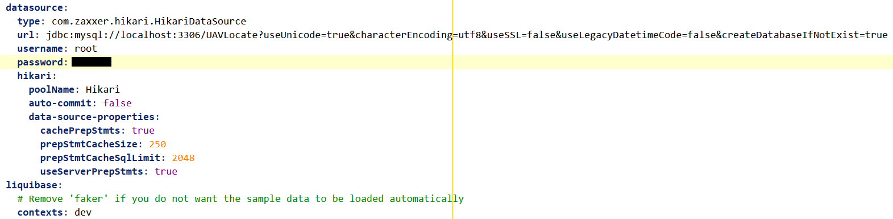
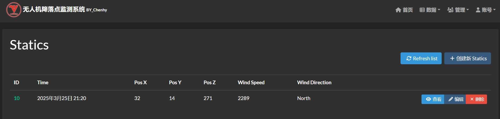
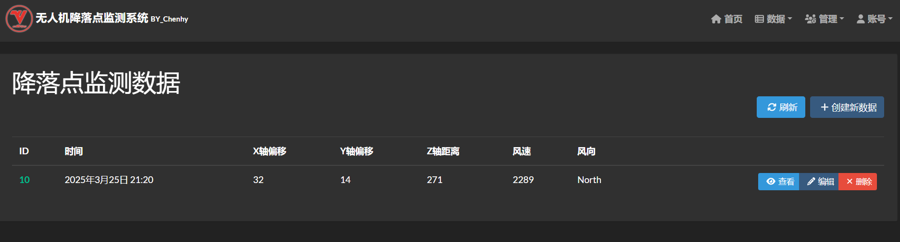
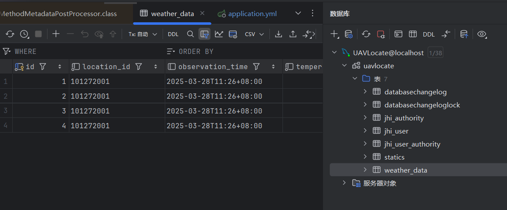
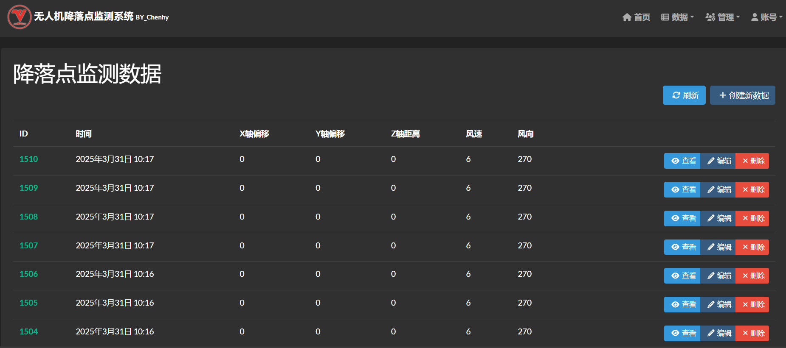

# UAVLocate


# 2025.3 I

## :pushpin: **アルゴリズムの初期実装**

**（Pythonで無人機のXYZ座標を取得し、アルゴリズムでオフセットを計算してSpringBootに送信、Service層を通じてデータベースを更新）**

**エンティティ（entity）生成：データ - 付属Serviceクラス**


**X軸座標 posX、Y軸座標 posY、Z軸座標 posZ。**

**基準点の座標を設定し、無人機の飛行速度を固定するかカメラで決定（複雑）、**

**画面座標1単位が現実で移動する距離を測定し、XY軸のずれを計算。**

**風速・風向きおよびZ軸距離に基づき、最終的な着地点のオフセットを推定。**

**例：基準点を`（10，10，10）`とし、画面1単位が現実の`0.02m`に対応、風速`0.02m/s`、風向き`北西30°`とする。**

**（地表近くでは垂直風向きは考慮不要）**

**アルゴリズムの実装過程は以下の通り：**

**無人機の位置座標`(32，56，207)`を取得し、相対座標`(22，46，197)`を計算、現実の3次元距離`(0.44m,0.92m,3.94m)`に対応**

**無人機の降下速度は固定で`0.4m/s`。**

**降下に必要な時間は`197\*0.02/0.4=9.85s`、**

**風速`0.02m/s`を風向きに基づきX軸風速とY軸風速に分解、**


**風による無人機のX軸オフセット`(-1)0.02·sin(30°)\*9.85=-0.0985m`**

**風による無人機のY軸オフセット`(+1)0.02·cos(30°)\*9.85=0.1706m`**

**最終的なオフセットは`(0.44-0.0985,0.92+0.1706)`。**

**ただし、風が無人機にこれほどのオフセットを与えることは現実的ではなく、これは理想的な場合。現在の機体には防風安定機能もある。**

**姿勢量の変化もあまり考慮していない。**

**まずはこのように進めるが、風向きを風速計から度数で取得できるかは不明。**

### **Python** :link:

**Pythonで直接アルゴリズムを実装するか、Springbootに渡してから処理する。**

```python
import requests
import math

# 無人機の現在位置
current_position = (32, 56, 207)  # (X, Y, Z)

# 基準点位置
reference_position = (10, 10, 10)  # (X, Y, Z)

# 風速と風向き
wind_speed = 0.02  # m/s
wind_direction = 30  # 北西30°、つまり30°

# 相対座標を計算
relative_position = (
    current_position[0] - reference_position[0],
    current_position[1] - reference_position[1],
    current_position[2] - reference_position[2]
)

# 現実の距離を計算
real_position = (
    relative_position[0] * 0.02,
    relative_position[1] * 0.02,
    relative_position[2] * 0.02
)

# 降下時間を計算
descent_speed = 0.4  # m/s
descent_time = real_position[2] / descent_speed

# 風向きのX軸とY軸成分を計算
wind_x = wind_speed * math.sin(math.radians(wind_direction))
wind_y = wind_speed * math.cos(math.radians(wind_direction))

# 風によるオフセットを計算
wind_offset_x = -wind_x * descent_time
wind_offset_y = wind_y * descent_time

# 最終的なオフセットを計算
final_offset = (
    real_position[0] + wind_offset_x,
    real_position[1] + wind_offset_y
)

# 結果を表示
print(f"相対座標: {relative_position}")
print(f"現実距離: {real_position}")
print(f"降下時間: {descent_time} 秒")
print(f"風によるオフセット: X軸 {wind_offset_x} m, Y軸 {wind_offset_y} m")
print(f"最終オフセット: {final_offset}")

# データをSpring Bootバックエンドに送信
url = "http://localhost:8080/api/drone/position"
data = {
    "x": current_position[0],
    "y": current_position[1],
    "z": current_position[2],
    "final_offset_x": final_offset[0],
    "final_offset_y": final_offset[1]
}
response = requests.post(url, json=data)
print(f"バックエンド応答: {response.text}")
```

### **SpringBoot** :link:

```java
@RestController
@RequestMapping("/api/drone")
public class DronePositionResource {

  @Autowired
  private DronePositionRepository dronePositionRepository;

  @PostMapping("/position")
  public ResponseEntity<String> updateDronePosition(@RequestBody DronePosition position) {
    // データベースにデータを保存
    dronePositionRepository.save(position);
    return ResponseEntity.ok("データ更新成功");
  }
}

```

## **:question: Z座標の取得**

**いくつかのウェブページを調査したが、物体の3次元座標を取得する方法は多数あるものの、**

**両眼・三眼カメラで取得できる座標は精度が不十分。**

**単眼カメラ＋センサーが最適な実装方法だが、データ転送速度が遅いという問題がある。そこで深度カメラとAIモデルを使用する方法を見つけた。**

**資金が十分であればInterのD435i深度カメラを使用したいが、資金が不足している場合はどうするか。**

# 2025.3 II

## :ballot_box_with_check: プロジェクト再開

**会社のプロジェクトを終えた後、viteのエラーに気づく。**


**viteのエラーはnodejsのバージョンを戻したためで、nvmで新しいバージョンに切り替え、package.jsonとnode_moudlesを削除して依存関係を再インストールすれば問題ない。**

**その後、JDLエンティティをインポートする際にjhipsterがクラッシュ。**

**jhipsterが消えたのは、nodeを再インストールした際にすべてのパッケージが消去されたため。**


**JDLエンティティのインポートに成功。**


**Springbootを起動すると、ポートが使用中というエラーが発生。**


**使用中のポートを特定し、プロセスを終了。**


**Springbootの起動に成功 :v:**


**Springbootの設定ファイルapplication-dev.ymlでmySqlデータベースを設定し、liquibaseのダミーデータ生成を無効化。**:paperclip:



**データインターフェースが完成、後でデータを読み取り専用に設定予定。**

**実装予定の内容：（2択）**

:o: **案1：数秒ごとに新しいデータを更新し、データを降順に並べ替え、新しいデータが最上部に表示されるようにする。**

:speech_balloon: **問題：数秒ごとの間隔を固定すると、場合によっては完全なデータが読み込まれない可能性がある。**

:o: **案2：データが更新されるたびに新しいデータを更新し、データを降順に並べ替え、新しいデータが最上部に表示されるようにする。**

:speech_balloon: **問題：データ更新ごとに更新すると、テストや閲覧に不便なほど速くまたは遅くデータが表示される可能性がある。**

**暫定的に最初の案を選択し、更新間隔を長めに設定し、後で調整する。**



**i18nで日本語を設定：**

```java
{
  "uavLocateApp": {
    "statics": {
      "home": {
        "title": "着地点モニタリングデータ",
        "refreshListLabel": "更新",
        "createLabel": "新規データ作成",
        "createOrEditLabel": "データ作成または編集",
        "notFound": "データが見つかりません"
      },
      "created": "データ { param } が正常に作成されました",
      "updated": "データ { param } が正常に更新されました",
      "deleted": "データ { param } が正常に削除されました",
      "delete": {
        "question": "データ { id } を削除してもよろしいですか？"
      },
      "detail": {
        "title": "着地点モニタリングデータ"
      },
      "id": "番号",
      "time": "時間",
      "posX": "X軸オフセット",
      "posY": "Y軸オフセット",
      "posZ": "Z軸距離",
      "windSpeed": "風速",
      "windDirection": "風向き"
    }
  }
}
```

**効果：**



### SpringBoot :link:

**Pageableを使用してデータを降順に並べ替え：**

```java
//Serviceクラス
@Transactional(readOnly = true)
public Optional<Statics> findOne(Long id) {
  LOG.debug("Request to get Statics : {}", id);
  return staticsRepository.findById(id);
}

```

**Resourceクラスで呼び出し、getContent()で並べ替えられたListを渡す：**

```java
@GetMapping("")
public List<Statics> getAllStatics(@RequestParam(name = "sort", required = false, defaultValue = "id,desc") String sort) {
  LOG.debug("REST request to get all Statics");
  Pageable pageable = PageRequest.of(0, 20);
  if (sort != null && !sort.isEmpty()) {
    String[] sortParams = sort.split(",");
    Sort.Direction direction = "desc".equalsIgnoreCase(sortParams[1]) ? Sort.Direction.DESC : Sort.Direction.ASC;
    pageable = PageRequest.of(pageable.getPageNumber(), pageable.getPageSize(), Sort.by(direction, sortParams[0]));
  }
  return staticsService.findAll(pageable).getContent();
}

```

**効果：**


# 2025.3 III

## :sun_with_face: 気象APIの取得

**風速計の設置とデータ転送が複雑すぎるなどの理由で、APIからデータを取得してSpring Bootに転送する方法に変更。**

:o:**APIを使用してデータを取得する利点と欠点：**

**APIは標準化されたデータインターフェースを提供し、HTTPリクエストで直接データを取得できるため、複雑なハードウェア設備や現場設置が不要。**

**データは通常構造化された形式（JSONやXML）で返され、解析と処理が容易。**

**また、多くの気象APIはリアルタイムデータまたは高頻度で更新されるデータを提供し、リアルタイムの気象情報ニーズを満たすことができる。**

**ただし、APIプロバイダーがデータ形式やインターフェースを調整する可能性があり、コードを適時更新する必要がある。一方、風速計は現在の風速と風向きをリアルタイムで測定でき、データ取得に遅延はほとんどない。**

**そして最も恐ろしい点：主要な気象APIは毎月4桁以上の金額を支払う必要がある。**

**そのため、アルゴリズムの実装位置をSpringbootのServiceクラスに固定し、pythonは使用せず、pythonは無人機の3次元位置データのみを提供する。**


:warning:<font color = red>**もし直接Springbootに転送できるなら、pythonも停止するが、現在まだカメラを選択していない。**</font>

**ここでは心知天气のAPIを選択し、5分ごとに1回データを転送でき、私たちのニーズを十分に満たす。**


**上図からわかるように、インターフェースから転送される必要なデータは風速`wind_speed`と風向角度`wind_direction_degree`で、**

**風向角度のデータは整数なので、0~360の度数と思われ、これに基づいてアルゴリズムの度数計算を更新する。**

**具体的な分析は以下の通り：**

**y軸正半軸を0度とし、右に度数が増加する場合、風向度数は以下のルールで方向に変換できる：**


**二つの方向の間の度数は、「偏」を使って表現できる。例えば、45°は「北東偏45度」と表現できる。**

**各方向の風速の計算:**


**テストの結果、心知天气の無料版では風速と風向角度データを取得できないが、問題ない、14日間の試用が可能。**

**それまでは、他の取得可能なデータを受信し、APIの接続性をテストする。**

# 2025.3 IV

## :sunflower: 和風天气API

**今日調査中に、360度風向と毎時風速を提供する別の無料APIを見つけた：和風天气、1日1000回のアクセスで十分。**


**必要なデータ：**

- **`now.wind360` [風向](https://dev.qweather.com/docs/resource/wind-info/#wind-direction)、360角度**
- **`now.windSpeed` [風速](https://dev.qweather.com/docs/resource/wind-info/#wind-speed)、キロメートル/時**

**APIフォーマット：`devapi.qweather.com/v7/weather/now?location=&key=`**

**生成されたAPIKey：`ec15c8e809f54b009f3ba76ab88c542c`**

**使用する都市ID：**

**上海市**

- **都市ID: `101020100`**

**徳陽市**

- **都市ID: `101272001`**

**:white_check_mark:徳陽市のリアルタイム天気データのJSONを正常に取得**


### SpringBoot :link:

**weatherData:**

```java
package com.chenhy.domain;

import jakarta.persistence.*;
import java.io.Serializable;

@Entity
@Table(name = "weather_data")
public class WeatherData implements Serializable {

  @Id
  @GeneratedValue(strategy = GenerationType.IDENTITY)
  private Long id;

  private String locationId;
  private Integer temperature;
  private Integer windSpeed;
  private String windDirection;
  private String observationTime; // String型に変更
  // 以下はgetterとsetter
}

```

**configクラスでrestTemplateを定義：**

```java
@Configuration
public class RestTemplateConfig {

  @Bean
  public RestTemplate restTemplate(RestTemplateBuilder builder) {
    // SimpleClientHttpRequestFactoryをカスタマイズしてタイムアウトを設定
    SimpleClientHttpRequestFactory requestFactory = new SimpleClientHttpRequestFactory();
    requestFactory.setConnectTimeout(5000); // 接続タイムアウト5秒
    requestFactory.setReadTimeout(30000); // 読み取りタイムアウト30秒

    // カスタムRequestFactoryでRestTemplateを構築
    RestTemplate restTemplate = builder.requestFactory(() -> requestFactory).build();
    return restTemplate;
  }
}

```

**serviceクラスを作成：**

```java
package com.chenhy.service;

import com.chenhy.domain.WeatherData;
import com.chenhy.repository.WeatherDataRepository;
import com.chenhy.service.dto.HeWeatherNowResponse;
import com.chenhy.service.mapper.WeatherMapper;
import org.slf4j.Logger;
import org.slf4j.LoggerFactory;
import org.springframework.beans.factory.annotation.Value;
import org.springframework.stereotype.Service;
import org.springframework.transaction.annotation.Transactional;
import org.springframework.web.client.RestTemplate;

@Service
@Transactional
public class HeWeatherService {

  private final Logger log = LoggerFactory.getLogger(HeWeatherService.class);

  private final WeatherDataRepository weatherDataRepository;
  private final WeatherMapper weatherMapper;
  private final RestTemplate restTemplate;

  // 設定パラメータ
  @Value("${heweather.api.key}")
  private String apiKey;

  @Value("${heweather.api.url}")
  private String apiUrl;

  public HeWeatherService(WeatherDataRepository weatherDataRepository, WeatherMapper weatherMapper, RestTemplate restTemplate) {
    this.weatherDataRepository = weatherDataRepository;
    this.weatherMapper = weatherMapper;
    this.restTemplate = restTemplate;
  }

  @Transactional
  public HeWeatherNowResponse fetchAndSaveWeather(String locationId) {
    HeWeatherNowResponse response = fetchFromApi(locationId);
    WeatherData weatherData = weatherMapper.toEntity(response);
    weatherData.setLocationId(locationId);
    WeatherData savedData = weatherDataRepository.save(weatherData);
    return weatherMapper.toDto(savedData);
  }

  private HeWeatherNowResponse fetchFromApi(String locationId) {
    String url = String.format("%s?location=%s&key=%s", apiUrl, locationId, apiKey);
    return restTemplate.getForObject(url, HeWeatherNowResponse.class);
  }
}

```

**repositoryクラスを作成：**

```java
package com.chenhy.repository;

import com.chenhy.domain.WeatherData;
import org.springframework.data.jpa.repository.*;
import org.springframework.stereotype.Repository;

@Repository
public interface WeatherDataRepository extends JpaRepository<WeatherData, Long> {
  // カスタムクエリメソッドを追加
  WeatherData findFirstByLocationIdOrderByObservationTimeDesc(String locationId);
}

```

**返されるJSON形式に基づいてDTOを作成：**

```java
package com.chenhy.service.dto;

import java.util.List;

public class HeWeatherNowResponse {

  private String code;
  private String updateTime;
  private String fxLink;
  private Now now;
  private Refer refer;

  // GettersとSetters

  public static class Now {

    private String obsTime;
    private Integer temp;
    private String feelsLike;
    private String icon;
    private String text;
    private String wind360;
    private String windDir;
    private String windScale;
    private Integer windSpeed;
    private String humidity;
    private String precip;
    private String pressure;
    private String vis;
    private String cloud;
    private String dew;
    // GettersとSetters
  }

  public static class Refer {

    private List<String> sources;
    private List<String> license;
    // GettersとSetters
  }
}

```

**ルートコントローラー：**

```java
package com.chenhy.web.rest;

import com.chenhy.domain.WeatherData;
import com.chenhy.service.HeWeatherService;
import com.chenhy.service.dto.HeWeatherNowResponse;
import org.slf4j.Logger;
import org.slf4j.LoggerFactory;
import org.springframework.http.ResponseEntity;
import org.springframework.web.bind.annotation.*;

@RestController
@RequestMapping("/api/weather")
public class WeatherResource {

  private final Logger log = LoggerFactory.getLogger(WeatherResource.class);

  private final HeWeatherService heWeatherService;

  public WeatherResource(HeWeatherService heWeatherService) {
    this.heWeatherService = heWeatherService;
  }

  @GetMapping("/{locationId}")
  public ResponseEntity<HeWeatherNowResponse> getWeatherData(@PathVariable String locationId) {
    log.debug("REST request to get weather for location: {}", locationId);
    HeWeatherNowResponse result = heWeatherService.fetchAndSaveWeather(locationId);
    return ResponseEntity.ok(result);
  }
}

```

# 2025.3 V

## :package: JSONの解凍

**昨日書いたAPIインターフェースをテストしたが、返されるJSONに不正な文字が含まれているというエラーが続き、不正な文字を処理した後もJSONを正常に受信できない。**

**今日和風天气のオープンドキュメントを再度確認したところ、そのAPIが返すデータはすべてGzipで圧縮されていることがわかったので、Gzipを処理する。**

### SpringBoot :link:

```java
@Configuration
public class RestTemplateConfig {

  @Bean
  public RestTemplate restTemplate(RestTemplateBuilder builder) {
    // SimpleClientHttpRequestFactoryをカスタマイズしてタイムアウトを設定
    SimpleClientHttpRequestFactory requestFactory = new SimpleClientHttpRequestFactory();
    requestFactory.setConnectTimeout(5000); // 接続タイムアウト5秒
    requestFactory.setReadTimeout(30000); // 読み取りタイムアウト30秒

    // カスタムRequestFactoryでRestTemplateを構築
    RestTemplate restTemplate = builder.requestFactory(() -> requestFactory).build();

    // Gzip解凍インターセプターを追加
    List<ClientHttpRequestInterceptor> interceptors = new ArrayList<>(restTemplate.getInterceptors());
    interceptors.add(new GzipDecompressingClientHttpRequestInterceptor());
    restTemplate.setInterceptors(interceptors);

    return restTemplate;
  }

  // カスタムGzip解凍インターセプター
  public static class GzipDecompressingClientHttpRequestInterceptor implements ClientHttpRequestInterceptor {

    @Override
    public ClientHttpResponse intercept(HttpRequest request, byte[] body, ClientHttpRequestExecution execution) throws IOException {
      ClientHttpResponse response = execution.execute(request, body);
      if (isGzipResponse(response)) {
        return new GzipDecompressingClientHttpResponse(response);
      }
      return response;
    }

    private boolean isGzipResponse(ClientHttpResponse response) {
      return "gzip".equalsIgnoreCase(response.getHeaders().getFirst("Content-Encoding"));
    }

    private static class GzipDecompressingClientHttpResponse implements ClientHttpResponse {

      private final ClientHttpResponse response;

      public GzipDecompressingClientHttpResponse(ClientHttpResponse response) {
        this.response = response;
      }

      @Override
      public InputStream getBody() throws IOException {
        return new GZIPInputStream(response.getBody());
      }

      @Override
      public HttpStatusCode getStatusCode() throws IOException {
        return response.getStatusCode();
      }

      @Override
      public String getStatusText() throws IOException {
        return response.getStatusText();
      }

      @Override
      public void close() {
        response.close();
      }

      @Override
      public org.springframework.http.HttpHeaders getHeaders() {
        return response.getHeaders();
      }
    }
  }
}

```

**mySqlで天気データを受け取るためのテーブルを作成：**


**気象データを正常に取得し、データベーステーブルに保存：**



**呼び出しテスト：**


**テストページ:/weather：**


**これで気象APIの呼び出しが完了し、取得したデータはwind360とwindSpeedで、weather_dataテーブルに保存されている。**

# 2025.3 VI

## :hourglass: 定時更新機能の追加

**機能（ロジック）を追加：10秒ごとに新しいStaticsを更新し、weatherDataRepositoryの**

**findFirstByLocationIdOrderByObservationTimeDesc(locationId)メソッドを呼び出し、**

**weather_dataテーブルの最新のデータの風速と風向を新しいデータに保存する。**

### SpringBoot :link:

**WeatherDataRepository内のカスタムクエリメソッド:**

```java
WeatherData findFirstByLocationIdOrderByObservationTimeDesc(String locationId);

```

**SpringBootプログラムに注釈を追加してスケジュールタスクを有効化：**

```java
import org.springframework.scheduling.annotation.EnableScheduling;

@SpringBootApplication
@EnableScheduling
```

**StaticsService内のロジック実装：**

```java
@Scheduled(fixedRate = 10000) // 10秒ごと
public void addNewStatics() {
  LOG.debug("新しいStaticsを追加するスケジュールタスクを実行");

  String locationId = "101272001"; // 徳陽でテスト
  LOG.debug("使用中のlocationId: {}", locationId); // locationIdをログ出力

  // 最新のWeatherDataレコードを取得
  WeatherData latestWeatherData = weatherDataRepository.findFirstByLocationIdOrderByObservationTimeDesc(locationId);
  if (latestWeatherData != null) {
    Statics newStatics = new Statics();
    newStatics.setWindSpeed(latestWeatherData.getWindSpeed().longValue());
    newStatics.setWindDirection(latestWeatherData.getWindDirection());

    // 他のフィールドを設定、ここではnullまたはデフォルト値とする
    newStatics.setTime(java.time.Instant.now());
    newStatics.setPosX(0L);
    newStatics.setPosY(0L);
    newStatics.setPosZ(0L);

    // 新しいStaticsレコードを保存
    Statics savedStatics = save(newStatics);
    LOG.debug("新しいStaticsレコードが追加されました ID: {}", savedStatics.getId());
  } else {
    LOG.warn("新しいStaticsレコードを作成するための最新のWeatherDataが見つかりません locationId: {}", locationId); // ログ出力にlocationIdを含める
  }
}

```

**効果：**



**次に必要なのはXYZ座標を取得し、別のテーブルPosDataに保存し、この新しいデータのXYZフィールドに割り当てること。**

**風向360と言っても、少なくとも45°の差がある......**

**今日はフロントエンドも更新し、来月はアルゴリズムに取り組む。**

**現在のデータインターフェースのデータは静的で、更新しないと新しいデータが表示されないので、リアクティブにしてみる。**

**開題報告の時に最初のバージョンのフロントエンドを作ったが、記録していなかった。次はホームページを刷新する。**

# 2025.4 I

## :bookmark_tabs: フロントエンド更新 I

**以前のホームページは確かに少し見栄えが悪かったので、新しい設計案はホームページにいくつかのモジュールを配置し、モジュール内にアイコンとデータを配置する。**

**最近会社で作った大型スクリーンのフロントエンドがちょうど使える。**

**まずstaticsインターフェースを動的にリアクティブにし、毎秒自動的にデータを更新する。**

### TypeScript :link:

**statics.component.ts:**

```typescript
import { type Ref, defineComponent, inject, onMounted, onUnmounted, ref } from 'vue';
import { useI18n } from 'vue-i18n';
import axios from 'axios';

import StaticsService from './statics.service';
import { type IStatics } from '@/shared/model/statics.model';
import { useDateFormat } from '@/shared/composables';
import { useAlertService } from '@/shared/alert/alert.service';

export default defineComponent({
  compatConfig: { MODE: 3 },
  name: 'Statics',
  setup() {
    const { t: t$ } = useI18n();
    const dateFormat = useDateFormat();
    const staticsService = inject('staticsService', () => new StaticsService());
    const alertService = inject('alertService', () => useAlertService(), true);

    const statics: Ref<IStatics[]> = ref([]);
    const isFetching = ref(false);
    let refreshInterval: number | null = null;

    const clear = () => {
      if (refreshInterval) {
        window.clearInterval(refreshInterval);
        refreshInterval = null;
      }
    };

    const retrieveStaticss = async () => {
      if (isFetching.value) return; // 重複リクエスト防止
      isFetching.value = true;
      try {
        const res = await staticsService().retrieve();
        statics.value = res.data;
      } catch (err: unknown) {
        if (axios.isAxiosError(err)) {
          alertService.showHttpError(err.response);
        }
      } finally {
        isFetching.value = false;
      }
    };

    const handleSyncList = () => {
      retrieveStaticss();
    };

    onMounted(async () => {
      await retrieveStaticss();
      // 1秒ごとにデータを自動更新
      refreshInterval = window.setInterval(retrieveStaticss, 1000);
    });

    onUnmounted(() => {
      clear();
    });

    const removeId = ref<number | null>(null);
    const removeEntity = ref<any>(null);
    const prepareRemove = (instance: IStatics) => {
      if (instance.id) {
        removeId.value = instance.id;
        removeEntity.value.show();
      }
    };
    const closeDialog = () => {
      removeEntity.value.hide();
    };
    const removeStatics = async () => {
      if (!removeId.value) return;
      try {
        await staticsService().delete(removeId.value);
        const message = t$('uavLocateApp.statics.deleted', { param: removeId.value }).toString();
        alertService.showInfo(message, { variant: 'danger' });
        removeId.value = null;
        retrieveStaticss();
        closeDialog();
      } catch (error: unknown) {
        if (axios.isAxiosError(error)) {
          alertService.showHttpError(error.response);
        }
      }
    };

    return {
      statics,
      handleSyncList,
      isFetching,
      retrieveStaticss,
      clear,
      ...dateFormat,
      removeId,
      removeEntity,
      prepareRemove,
      closeDialog,
      removeStatics,
      t$,
    };
  },
});
```

**効果：**


**次にホームページを美化：ヘッダー画像+タイトル、左右両側の半透明サイドバー。**

**スクロールバーをインポートし、現在の無人機の位置データと現在の風速・風向を表示する。**

### Vue :link:

**コンポーネントscrollBox.vue:**
