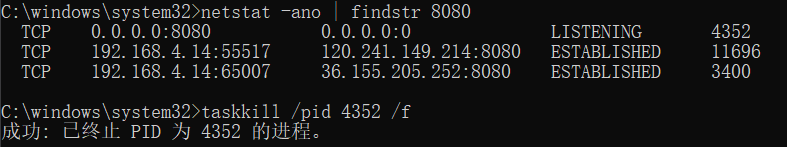
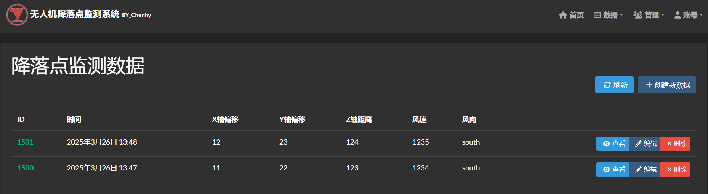
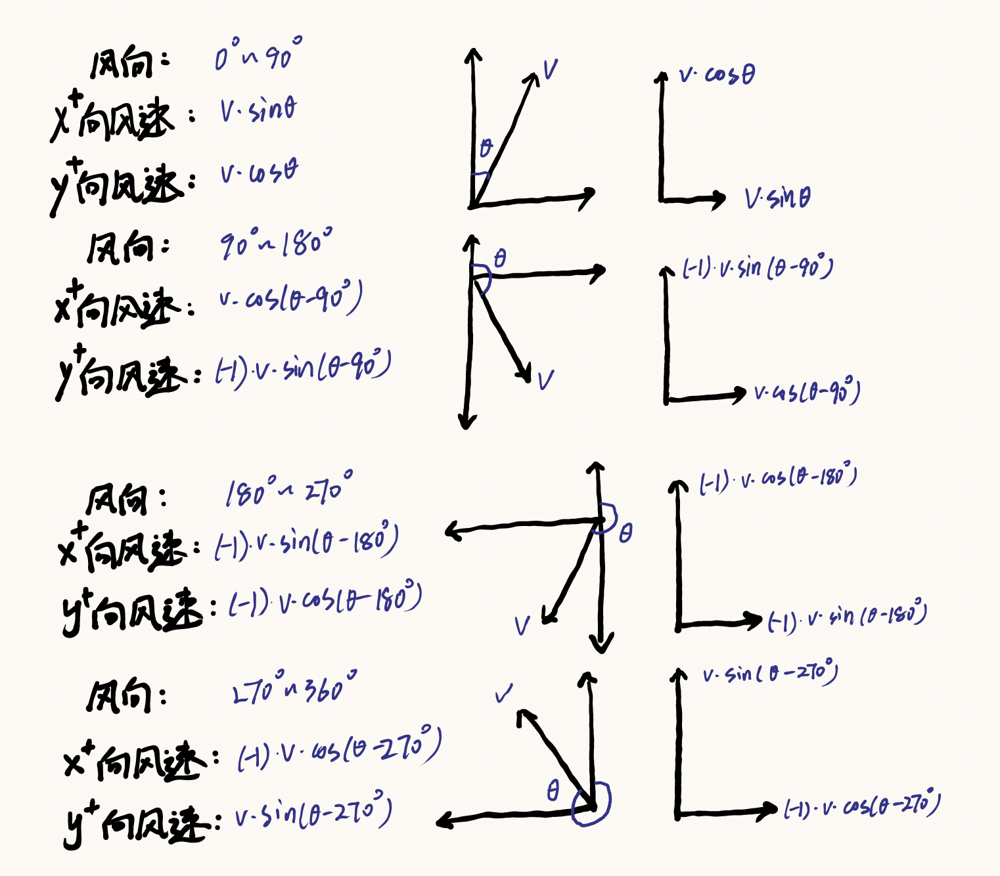
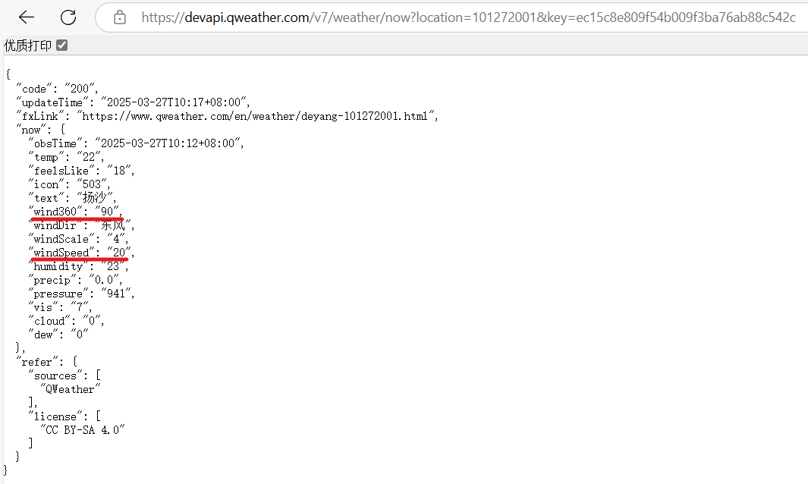
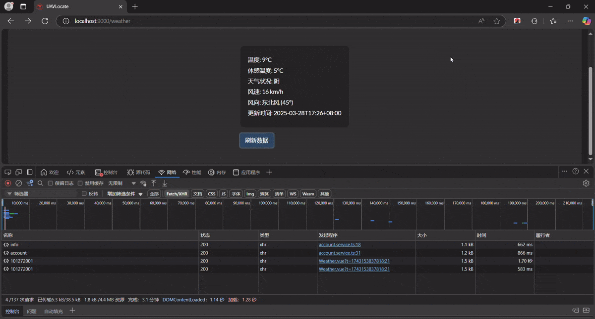
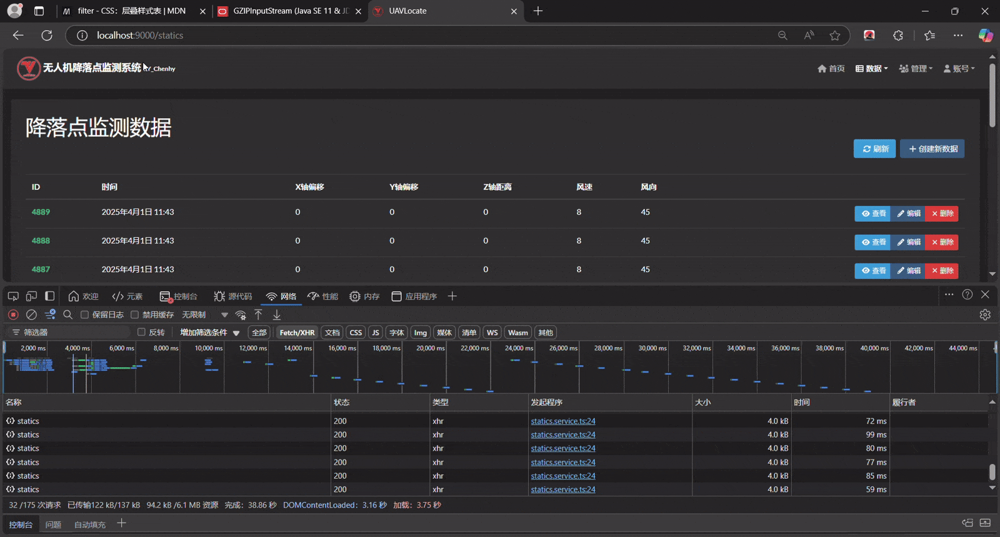

# UAVLocate


# 2025.3 I

## :pushpin: **算法初步实现**

**（python 获取无人机XYZ坐标并算法计算出偏移再传输给 springboot,通过 service 层修改数据库）**

**生成实体（entity）：数据-附带 Service类**​​


**x轴坐标 posX，y轴坐标 posY，z轴坐标 posZ。**

**设定出参考点的坐标，固定无人机的飞行速度或通过摄像机确定（复杂），**

**并测量出屏幕坐标移动1个单位现实移动的距离，即可计算XY轴偏离。**

**根据风速风向以及Z轴距离估算降落点最终偏移。**

**举例：参考点设为`（10，10，10）`，假定屏幕1单位对应现实`0.02m`，风速`0.02m/s`，风向为`北偏西30°`。**

**（近地情况无需考虑垂直风向）**

**那么算法实现过程如下：**

**拿到无人机位置坐标`(32，56，207)`，计算出相对坐标`(22，46，197)`，对应现实三维距离`(0.44m,0.92m,3.94m)`**

**无人机下降速度固定为`0.4m/s`。**

**那么下降所需时间为`197\*0.02/0.4=9.85s`，**

**风速为`0.02m/s`根据风向可拆分为X轴风速和Y轴风速，**

****

**风将使无人机产生的X轴偏移`(-1)0.02·sin(30°)\*9.85=-0.0985m`**

**风将使无人机产生的Y轴偏移`(+1)0.02·cos(30°)\*9.85=0.1706m`**

**那么最终偏移即`(0.44-0.0985,0.92+0.1706)`。**

**不过风不可能对无人机造成这么大的偏移，这是理想情况下，现在的飞机还都有防风稳定呢。**

**姿态量变化也没怎么考虑。**

**首先就这样，也不知道风向能不能通过风速计获取度数。**

### **Python** :link:

**可以直接在 Python 中实现算法，也可以传入 Springboot 后端。**

```python
import requests
import math

# 无人机当前位置
current_position = (32, 56, 207)  # (X, Y, Z)

# 参考点位置
reference_position = (10, 10, 10)  # (X, Y, Z)

# 风速和风向
wind_speed = 0.02  # m/s
wind_direction = 30  # 北偏西30°，即30°

# 计算相对坐标
relative_position = (
    current_position[0] - reference_position[0],
    current_position[1] - reference_position[1],
    current_position[2] - reference_position[2]
)

# 计算现实中的距离
real_position = (
    relative_position[0] * 0.02,
    relative_position[1] * 0.02,
    relative_position[2] * 0.02
)

# 计算下降时间
descent_speed = 0.4  # m/s
descent_time = real_position[2] / descent_speed

# 计算风向的X轴和Y轴分量
wind_x = wind_speed * math.sin(math.radians(wind_direction))
wind_y = wind_speed * math.cos(math.radians(wind_direction))

# 计算风引起的偏移
wind_offset_x = -wind_x * descent_time
wind_offset_y = wind_y * descent_time

# 计算最终偏移
final_offset = (
    real_position[0] + wind_offset_x,
    real_position[1] + wind_offset_y
)

# 打印结果
print(f"相对坐标: {relative_position}")
print(f"现实距离: {real_position}")
print(f"下降时间: {descent_time} 秒")
print(f"风引起的偏移: X轴 {wind_offset_x} m, Y轴 {wind_offset_y} m")
print(f"最终偏移: {final_offset}")

# 将数据发送到Spring Boot后端
url = "http://localhost:8080/api/drone/position"
data = {
    "x": current_position[0],
    "y": current_position[1],
    "z": current_position[2],
    "final_offset_x": final_offset[0],
    "final_offset_y": final_offset[1]
}
response = requests.post(url, json=data)
print(f"后端响应: {response.text}")
```

### **SpringBoot** :link:

```java
@RestController
@RequestMapping("/api/drone")
public class DronePositionResource {

  @Autowired
  private DronePositionRepository dronePositionRepository;

  @PostMapping("/position")
  public ResponseEntity<String> updateDronePosition(@RequestBody DronePosition position) {
    // 保存数据到数据库
    dronePositionRepository.save(position);
    return ResponseEntity.ok("更新数据成功");
  }
}

```

## **:question: Z坐标获取**

**查阅了一些网页，要获取物体三维坐标的方法有很多，但是双目，三目摄像头获取到的坐标都不够准确。**

**单目 + 传感器其实是最佳实现方法，不过数据传输速度过慢也是问题，这时我就看到了深度相机，可以使用ai模型**。

**资金充足的情况下想要使用的是 Inter 的 D435i 深度相机，那资金不充足怎么办呢**。

# 2025.3 II

## :ballot_box_with_check: 项目重启

**做完公司项目之后回来看发现 vite 报错。**

****

**vite 是因为 nodejs 版本被我回退了，用 nvm 切换到新版本之后把 package.json 和 node_moudles 删除后重新安装依赖就没问题了。**

**然后在导入 JDL 实体的时候 jhipster 挂了，**

**jhipster 为什么会失踪，原来是我重装 node 的时候把所有的包都清理了。**


**成功导入 JDL 实体。**


**启动 Springboot，报错端口被占用。**


**找到被占用的端口，终止进程。**



**Springboot 启动成功 :v:**


**在 Springboot 配置文件 application-dev.yml 中配置 mySql 数据库，关闭 liquibase 伪数据生成。**:paperclip:


**数据界面完成，后面会把数据设为只读。**

**预计实现的内容：（2选1）**

:o: **方案一：每隔几秒更新一条新的数据，并将数据按倒序排列，新数据会显示在最上方。**

:speech_balloon: **问题：每隔几秒的时间间隔需要固定可能在某些情况下无法加载出完整数据。**

:o: **方案二：每有数据刷新时更新一条新的数据，并将数据按倒序排列，新数据会显示在最上方。**

:speech_balloon: **问题：每有数据刷新就更新可能会时快时慢地刷出数据，不便于测试和查阅。**

**暂且选择第一种方案，先把刷新时间设的久一些，后续再调整。**


**在 i18n 配置中文：**

```json
{
  "uavLocateApp": {
    "statics": {
      "home": {
        "title": "降落点监测数据",
        "refreshListLabel": "刷新",
        "createLabel": "创建新数据",
        "createOrEditLabel": "创建或编辑数据",
        "notFound": "没有找到数据"
      },
      "created": "数据 { param } 创建成功",
      "updated": "数据 { param } 更新成功",
      "deleted": "数据 { param } 删除成功",
      "delete": {
        "question": "你确定要删除数据 { id } 吗？"
      },
      "detail": {
        "title": "降落点监测数据"
      },
      "id": "序号",
      "time": "时间",
      "posX": "X轴偏移",
      "posY": "Y轴偏移",
      "posZ": "Z轴距离",
      "windSpeed": "风速",
      "windDirection": "风向"
    }
  }
}
```

**效果：**


### SpringBoot :link:

**用 Pageable 实现倒序排列数据：**

```java
//Service类
@Transactional(readOnly = true)
public Optional<Statics> findOne(Long id) {
  LOG.debug("Request to get Statics : {}", id);
  return staticsRepository.findById(id);
}

```

**Resource 类调用并用 getContent() 传出排序后的 List：**

```java
@GetMapping("")
public List<Statics> getAllStatics(@RequestParam(name = "sort", required = false, defaultValue = "id,desc") String sort) {
  LOG.debug("REST request to get all Statics");
  Pageable pageable = PageRequest.of(0, 20);
  if (sort != null && !sort.isEmpty()) {
    String[] sortParams = sort.split(",");
    Sort.Direction direction = "desc".equalsIgnoreCase(sortParams[1]) ? Sort.Direction.DESC : Sort.Direction.ASC;
    pageable = PageRequest.of(pageable.getPageNumber(), pageable.getPageSize(), Sort.by(direction, sortParams[0]));
  }
  return staticsService.findAll(pageable).getContent();
}

```

**效果：**



# 2025.3 III

## :sun_with_face: 获取气象API

**由于风速计部署及数据传输过于复杂等原因，改用从 API 获取数据并传输到 Spring Boot中。**

:o:**使用 API 获取数据的优缺点：**

**API 提供了标准化的数据接口，可以直接通过 HTTP请求获取数据，无需复杂的硬件设备和现场部署。**

**数据通常以结构化的格式（如 JSON 或 XML）返回，易于解析和处理。**

**并且许多气象 API 提供实时数据或高频率更新的数据，能够满足对实时气象信息的需求。**

**不过 API 提供商可能会调整数据格式或接口，需要及时更新代码。而风力计可以实时测量当前的风速和风向，数据获取几乎无延迟。**

**然后是最恐怖的一点：主流气象 API 每个月都要支付四位数以上的价格。**

**因此也固定算法实现的位置为 Springboot 的 Service 类，而不再是使用 python，python 仅提供无人机的三维位置数据。**


:warning:<font color = red>**若能直接传输到springboot中，python也将停用，但目前仍未选择摄像头。**</font>

**这里选用的是心知天气的 API，每五分钟可传输一次数据，足以满足我们的需求。**


**由上图可见接口传输过来的我们所需要的数据为风速`wind_speed`和风向角度`wind_direction_degree`，**

**其中风向角度的数据为整数，那么应该就是 0~360 的度数，以此对算法度数计算进行更新。**

**具体分析如下：**

**以y轴正半轴为0度，向右增加度数，那么风向度数可以按照以下规则转换为方向：**


**对于介于两个方向之间的度数，可以描述为“偏”某个方向。例如，45°可以描述为“北偏东45度”。**

**计算各个方向的风速:**



**经过测试，心知天气免费版无法获得风速和风向角度数据，不过没有关系，可以试用14天。**

**那么在这之前，先接收一下其它可获取的数据，测试一下API的连通性。**

# 2025.3 IV

## :sunflower: 和风天气API

**今天查阅的时候发现了另一款有360度风向以及每小时风速的免费 API：和风天气，每日1000次的访问量已经足够。**


**需要的数据：**

- **`now.wind360` [风向](https://dev.qweather.com/docs/resource/wind-info/#wind-direction)，360角度**
- **`now.windSpeed` [风速](https://dev.qweather.com/docs/resource/wind-info/#wind-speed)，公里/小时**

**API 格式：`devapi.qweather.com/v7/weather/now?location=&key=`**

**生成的 APIKey：`ec15c8e809f54b009f3ba76ab88c542c`**

**需要使用的城市 id：**

**上海市**

- **城市ID: `101020100`**

**德阳市**

- **城市ID: `101272001`**

**:white_check_mark:成功获取到德阳市实时天气数据的 JSON**



### SpringBoot​ :link:

**weatherData:**

```java
package com.chenhy.domain;

import jakarta.persistence.*;
import java.io.Serializable;

@Entity
@Table(name = "weather_data")
public class WeatherData implements Serializable {

  @Id
  @GeneratedValue(strategy = GenerationType.IDENTITY)
  private Long id;

  private String locationId;
  private Integer temperature;
  private Integer windSpeed;
  private String windDirection;
  private String observationTime; // 修改为 String 类型
  // 下面是getter和setter
}

```

**config 类中定义 restTemplate：**

```java
@Configuration
public class RestTemplateConfig {

  @Bean
  public RestTemplate restTemplate(RestTemplateBuilder builder) {
    // 自定义 SimpleClientHttpRequestFactory 设置超时
    SimpleClientHttpRequestFactory requestFactory = new SimpleClientHttpRequestFactory();
    requestFactory.setConnectTimeout(5000); // 连接超时 5 秒
    requestFactory.setReadTimeout(30000); // 读取超时 30 秒

    // 使用自定义 RequestFactory 构建 RestTemplate
    RestTemplate restTemplate = builder.requestFactory(() -> requestFactory).build();
    return restTemplate;
  }
}

```

**创建 service 类：**

```java
package com.chenhy.service;

import com.chenhy.domain.WeatherData;
import com.chenhy.repository.WeatherDataRepository;
import com.chenhy.service.dto.HeWeatherNowResponse;
import com.chenhy.service.mapper.WeatherMapper;
import org.slf4j.Logger;
import org.slf4j.LoggerFactory;
import org.springframework.beans.factory.annotation.Value;
import org.springframework.stereotype.Service;
import org.springframework.transaction.annotation.Transactional;
import org.springframework.web.client.RestTemplate;

@Service
@Transactional
public class HeWeatherService {

  private final Logger log = LoggerFactory.getLogger(HeWeatherService.class);

  private final WeatherDataRepository weatherDataRepository;
  private final WeatherMapper weatherMapper;
  private final RestTemplate restTemplate;

  // 配置参数
  @Value("${heweather.api.key}")
  private String apiKey;

  @Value("${heweather.api.url}")
  private String apiUrl;

  public HeWeatherService(WeatherDataRepository weatherDataRepository, WeatherMapper weatherMapper, RestTemplate restTemplate) {
    this.weatherDataRepository = weatherDataRepository;
    this.weatherMapper = weatherMapper;
    this.restTemplate = restTemplate;
  }

  @Transactional
  public HeWeatherNowResponse fetchAndSaveWeather(String locationId) {
    HeWeatherNowResponse response = fetchFromApi(locationId);
    WeatherData weatherData = weatherMapper.toEntity(response);
    weatherData.setLocationId(locationId);
    WeatherData savedData = weatherDataRepository.save(weatherData);
    return weatherMapper.toDto(savedData);
  }

  private HeWeatherNowResponse fetchFromApi(String locationId) {
    String url = String.format("%s?location=%s&key=%s", apiUrl, locationId, apiKey);
    return restTemplate.getForObject(url, HeWeatherNowResponse.class);
  }
}

```

**创建 repository 类：**

```java
package com.chenhy.repository;

import com.chenhy.domain.WeatherData;
import org.springframework.data.jpa.repository.*;
import org.springframework.stereotype.Repository;

@Repository
public interface WeatherDataRepository extends JpaRepository<WeatherData, Long> {
  // 添加自定义查询方法
  WeatherData findFirstByLocationIdOrderByObservationTimeDesc(String locationId);
}

```

**根据返回的 JSON 格式创建 DTO：**

```java
package com.chenhy.service.dto;

import java.util.List;

public class HeWeatherNowResponse {

  private String code;
  private String updateTime;
  private String fxLink;
  private Now now;
  private Refer refer;

  // Getters和Setters

  public static class Now {

    private String obsTime;
    private Integer temp;
    private String feelsLike;
    private String icon;
    private String text;
    private String wind360;
    private String windDir;
    private String windScale;
    private Integer windSpeed;
    private String humidity;
    private String precip;
    private String pressure;
    private String vis;
    private String cloud;
    private String dew;
    // Getters和Setters
  }

  public static class Refer {

    private List<String> sources;
    private List<String> license;
    // Getters和Setters
  }
}

```

**路由控制器：**

```java
package com.chenhy.web.rest;

import com.chenhy.domain.WeatherData;
import com.chenhy.service.HeWeatherService;
import com.chenhy.service.dto.HeWeatherNowResponse;
import org.slf4j.Logger;
import org.slf4j.LoggerFactory;
import org.springframework.http.ResponseEntity;
import org.springframework.web.bind.annotation.*;

@RestController
@RequestMapping("/api/weather")
public class WeatherResource {

  private final Logger log = LoggerFactory.getLogger(WeatherResource.class);

  private final HeWeatherService heWeatherService;

  public WeatherResource(HeWeatherService heWeatherService) {
    this.heWeatherService = heWeatherService;
  }

  @GetMapping("/{locationId}")
  public ResponseEntity<HeWeatherNowResponse> getWeatherData(@PathVariable String locationId) {
    log.debug("REST request to get weather for location: {}", locationId);
    HeWeatherNowResponse result = heWeatherService.fetchAndSaveWeather(locationId);
    return ResponseEntity.ok(result);
  }
}

```

# 2025.3 V

## :package: ​JSON解包

**测试昨天写的 API 接口，一直报错返回的 JSON 含有非法字符，对非法字符处理后仍然无法正常接收到 JSON。**

**今天回去和风天气的开放文档又看了看，发现其API返回的数据均使用了 Gzip 压缩，那么接下来对 Gzip 进行处理。**

### SpringBoot :link:

```java
@Configuration
public class RestTemplateConfig {

  @Bean
  public RestTemplate restTemplate(RestTemplateBuilder builder) {
    // 自定义 SimpleClientHttpRequestFactory 设置超时
    SimpleClientHttpRequestFactory requestFactory = new SimpleClientHttpRequestFactory();
    requestFactory.setConnectTimeout(5000); // 连接超时 5 秒
    requestFactory.setReadTimeout(30000); // 读取超时 30 秒

    // 使用自定义 RequestFactory 构建 RestTemplate
    RestTemplate restTemplate = builder.requestFactory(() -> requestFactory).build();

    // 添加 Gzip 解压缩拦截器
    List<ClientHttpRequestInterceptor> interceptors = new ArrayList<>(restTemplate.getInterceptors());
    interceptors.add(new GzipDecompressingClientHttpRequestInterceptor());
    restTemplate.setInterceptors(interceptors);

    return restTemplate;
  }

  // 自定义 Gzip 解压缩拦截器
  public static class GzipDecompressingClientHttpRequestInterceptor implements ClientHttpRequestInterceptor {

    @Override
    public ClientHttpResponse intercept(HttpRequest request, byte[] body, ClientHttpRequestExecution execution) throws IOException {
      ClientHttpResponse response = execution.execute(request, body);
      if (isGzipResponse(response)) {
        return new GzipDecompressingClientHttpResponse(response);
      }
      return response;
    }

    private boolean isGzipResponse(ClientHttpResponse response) {
      return "gzip".equalsIgnoreCase(response.getHeaders().getFirst("Content-Encoding"));
    }

    private static class GzipDecompressingClientHttpResponse implements ClientHttpResponse {

      private final ClientHttpResponse response;

      public GzipDecompressingClientHttpResponse(ClientHttpResponse response) {
        this.response = response;
      }

      @Override
      public InputStream getBody() throws IOException {
        return new GZIPInputStream(response.getBody());
      }

      @Override
      public HttpStatusCode getStatusCode() throws IOException {
        return response.getStatusCode();
      }

      @Override
      public String getStatusText() throws IOException {
        return response.getStatusText();
      }

      @Override
      public void close() {
        response.close();
      }

      @Override
      public org.springframework.http.HttpHeaders getHeaders() {
        return response.getHeaders();
      }
    }
  }
}

```

**在mySql中创建用来接受天气数据的表：**

****

**成功获得气象数据并存入数据库表：**

****

**调用测试：**

****

**测试页面:/weather：**



**至此已完成气象API的调用，获得的数据是wind360和windSpeed，并存在表weather_data中。**

# 2025.3 VI

## :hourglass: ​添加定时更新功能

**添加功能（逻辑）：每十秒更新一条 Statics，并调用 weatherDataRepository 的**

**findFirstByLocationIdOrderByObservationTimeDesc(locationId) 方法，**

**将数据表 weather_data 最新一条数据的风速和风向存入该条新数据中。**

### SpringBoot :link:

**WeatherDataRepository内自定义查询方法:**

```java
WeatherData findFirstByLocationIdOrderByObservationTimeDesc(String locationId);

```

**SpringBoot程序添加注解启用定时任务：**

```java
import org.springframework.scheduling.annotation.EnableScheduling;

@SpringBootApplication
@EnableScheduling
```

**StaticsService内逻辑实现：**

```java
@Scheduled(fixedRate = 10000) // 10s
public void addNewStatics() {
  LOG.debug("Executing scheduled task to add new Statics");

  String locationId = "101272001"; // 用德阳测试
  LOG.debug("Using locationId: {}", locationId); // 添加日志输出locationId

  // 获取最新的WeatherData记录
  WeatherData latestWeatherData = weatherDataRepository.findFirstByLocationIdOrderByObservationTimeDesc(locationId);
  if (latestWeatherData != null) {
    Statics newStatics = new Statics();
    newStatics.setWindSpeed(latestWeatherData.getWindSpeed().longValue());
    newStatics.setWindDirection(latestWeatherData.getWindDirection());

    // 设置其他字段，这里假设其他字段可以为null或默认值
    newStatics.setTime(java.time.Instant.now());
    newStatics.setPosX(0L);
    newStatics.setPosY(0L);
    newStatics.setPosZ(0L);

    // 保存新的Statics记录
    Statics savedStatics = save(newStatics);
    LOG.debug("New Statics record added with ID: {}", savedStatics.getId());
  } else {
    LOG.warn("No latest WeatherData found to create a new Statics record for locationId: {}", locationId); // 修改日志输出，包含locationId
  }
}

```

**效果：**


**接下来需要的是获取XYZ坐标并存入另一个表 PosData 中，再调用赋予给这条新数据的XYZ字段上。**

**虽然说是风向360，但是最少也有45°的差距......**

**今天再更新一下前端，下个月要做算法了。**

**现在的数据界面数据是静态的，需要刷新才会显示出新数据，我试着把它做成响应式的吧。**

**在做开题报告的时候就把最初版本的前端给做出来了，没有记录。那接下来就把首页翻新一下。**

# 2025.4 I

## :bookmark_tabs: 前端更新 I

**之前那个首页确实有点丑了，新的设计方案大概就是在首页放置几个模块，模块内存放icon和数据。**

**前一段时间给公司做的大屏前端就刚好能拿来用了。**

**先将statics界面设为动态响应式，每秒自动刷新一次数据。**

### TypeScript​ :link:

**statics.component.ts:**

```typescript
import { type Ref, defineComponent, inject, onMounted, onUnmounted, ref } from 'vue';
import { useI18n } from 'vue-i18n';
import axios from 'axios';

import StaticsService from './statics.service';
import { type IStatics } from '@/shared/model/statics.model';
import { useDateFormat } from '@/shared/composables';
import { useAlertService } from '@/shared/alert/alert.service';

export default defineComponent({
  compatConfig: { MODE: 3 },
  name: 'Statics',
  setup() {
    const { t: t$ } = useI18n();
    const dateFormat = useDateFormat();
    const staticsService = inject('staticsService', () => new StaticsService());
    const alertService = inject('alertService', () => useAlertService(), true);

    const statics: Ref<IStatics[]> = ref([]);
    const isFetching = ref(false);
    let refreshInterval: number | null = null;

    const clear = () => {
      if (refreshInterval) {
        window.clearInterval(refreshInterval);
        refreshInterval = null;
      }
    };

    const retrieveStaticss = async () => {
      if (isFetching.value) return; // 防止重复请求
      isFetching.value = true;
      try {
        const res = await staticsService().retrieve();
        statics.value = res.data;
      } catch (err: unknown) {
        if (axios.isAxiosError(err)) {
          alertService.showHttpError(err.response);
        }
      } finally {
        isFetching.value = false;
      }
    };

    const handleSyncList = () => {
      retrieveStaticss();
    };

    onMounted(async () => {
      await retrieveStaticss();
      // 每1秒自动刷新一次数据
      refreshInterval = window.setInterval(retrieveStaticss, 1000);
    });

    onUnmounted(() => {
      clear();
    });

    const removeId = ref<number | null>(null);
    const removeEntity = ref<any>(null);
    const prepareRemove = (instance: IStatics) => {
      if (instance.id) {
        removeId.value = instance.id;
        removeEntity.value.show();
      }
    };
    const closeDialog = () => {
      removeEntity.value.hide();
    };
    const removeStatics = async () => {
      if (!removeId.value) return;
      try {
        await staticsService().delete(removeId.value);
        const message = t$('uavLocateApp.statics.deleted', { param: removeId.value }).toString();
        alertService.showInfo(message, { variant: 'danger' });
        removeId.value = null;
        retrieveStaticss();
        closeDialog();
      } catch (error: unknown) {
        if (axios.isAxiosError(error)) {
          alertService.showHttpError(error.response);
        }
      }
    };

    return {
      statics,
      handleSyncList,
      isFetching,
      retrieveStaticss,
      clear,
      ...dateFormat,
      removeId,
      removeEntity,
      prepareRemove,
      closeDialog,
      removeStatics,
      t$,
    };
  },
});
```

**效果：**



**接下来美化一下首页：头图+标题，左右两侧的半透明 Sidebar。**

**导入滚动栏，用于展示当前无人机的位置数据以及当前风速风向。**

### Vue :link:

**组件scrollBox.vue:**

```vue
<template>
  <div class="dqsj">
    <div class="dqsjtext">当前数据</div>
    <div class="lbg-container">
      <div class="lbgmc"></div>
      <div class="lbgmctext">
        序号&nbsp;&nbsp;&nbsp;&nbsp;时间&nbsp;&nbsp;&nbsp;&nbsp;&nbsp;&nbsp;&nbsp;&nbsp;&nbsp;&nbsp;&nbsp;&nbsp;&nbsp;&nbsp;&nbsp;&nbsp;&nbsp;&nbsp;&nbsp;&nbsp;&nbsp;&nbsp;&nbsp;&nbsp;&nbsp;&nbsp;&nbsp;&nbsp;&nbsp;&nbsp;&nbsp;&nbsp;&nbsp;&nbsp;&nbsp;&nbsp;&nbsp;&nbsp;&nbsp;&nbsp;X轴&nbsp;&nbsp;&nbsp;&nbsp;&nbsp;&nbsp;&nbsp;&nbsp;&nbsp;&nbsp;Y轴&nbsp;&nbsp;&nbsp;&nbsp;&nbsp;&nbsp;&nbsp;&nbsp;&nbsp;&nbsp;Z轴&nbsp;&nbsp;&nbsp;&nbsp;&nbsp;&nbsp;&nbsp;&nbsp;&nbsp;&nbsp;&nbsp;&nbsp;风速&nbsp;&nbsp;&nbsp;&nbsp;&nbsp;&nbsp;&nbsp;&nbsp;&nbsp;&nbsp;&nbsp;&nbsp;&nbsp;&nbsp;&nbsp;&nbsp;风向
      </div>
    </div>
    <vue3ScrollSeamless class="scroll-wrap" :classOptions="classOptions" :dataList="formattedList">
      <div v-if="formattedList.length > 0">
        <el-row v-for="(item, i) of formattedList" :key="i">
          <el-col :span="10" class="lbg">
            <div>{{ item }}</div>
          </el-col>
        </el-row>
      </div>
    </vue3ScrollSeamless>
  </div>
</template>

<script setup>
import { reactive, ref, computed, onMounted } from 'vue';
import { vue3ScrollSeamless } from 'vue3-scroll-seamless';
import StaticsService from '@/entities/statics/statics.service';
import { useDateFormat } from '@/shared/composables';

const dateFormat = useDateFormat();
const staticsService = new StaticsService();
const statics = ref([]);

const formattedList = computed(() => {
  return statics.value.map((item, index) => {
    const time = dateFormat.formatDateShort(item.time);
    return `\xa0\xa0\xa0\xa0\xa0\xa0\xa0\xa0\xa0\xa0\xa0\xa0\xa0\xa0\xa0\xa0\xa0\xa0${index + 1}\xa0\xa0\xa0\xa0\xa0\xa0\xa0\xa0${time}\xa0\xa0\xa0\xa0\xa0\xa0\xa0\xa0\xa0\xa0\xa0\xa0\xa0\xa0\xa0\xa0${item.posX}\xa0\xa0\xa0\xa0\xa0\xa0\xa0\xa0\xa0\xa0\xa0\xa0\xa0\xa0\xa0\xa0${item.posY}\xa0\xa0\xa0\xa0\xa0\xa0\xa0\xa0\xa0\xa0\xa0\xa0\xa0\xa0\xa0\xa0${item.posZ}\xa0\xa0\xa0\xa0\xa0\xa0\xa0\xa0\xa0\xa0\xa0\xa0\xa0\xa0\xa0\xa0\xa0\xa0\xa0\xa0\xa0\xa0\xa0\xa0${item.windSpeed}\xa0\xa0\xa0\xa0\xa0\xa0\xa0\xa0\xa0\xa0\xa0\xa0\xa0\xa0\xa0\xa0\xa0\xa0\xa0\xa0\xa0\xa0\xa0\xa0${item.windDirection}\xa0\xa0\xa0\xa0\xa0\xa0`;
  });
});

const classOptions = reactive({
  step: 0.5,
  limitMoveNum: 10,
  direction: 1,
});

const retrieveStaticss = async () => {
  try {
    const res = await staticsService.retrieve();
    statics.value = res.data;
  } catch (err) {
    console.error('Error fetching statics:', err);
  }
};

onMounted(async () => {
  await retrieveStaticss();
  // 每1秒刷新一次数据
  setInterval(retrieveStaticss, 1000);
});
</script>
```

**这里不可能调用API，而是调用了数据库最新一条的数据，这样可以节省API申请次数。**

**效果：展示20个数据，新的数据序号在前，保持刷新。**


# 2025.4 II

## :bookmark: 前端更新 II

**这几天公司的任务稍微有点多，不过都做好了，现在让我们继续来更新前端。**

**我又想了想这样的前端确实是有些商业化了，以至于不会让人觉得是一个学生做的，所以我们还是做得简约一点吧。**

**直接从学校官网扒了几张图片拿来用，先把科技感满满的头图给换掉，右边的滚动栏暂时保留。**

**左侧放的是最终偏移数据，占用不了很大的空间，总之先缩短。**


**这样的话空间也足以接入摄像头的画面。**

**先插入一个视频播放器替代。**

**一共添加两个组件：**

- **将天气数据获取到的风速和风向展示出来**
- **以及实时监控视频**

**效果：（先填充了一个网上扒的测试视频）**


**那么中间空余的部分就非最终偏移数据莫属了，接下来完善后端算法。**

# 2025.4 III

## :chart_with_upwards_trend: 算法重写

**目前不再打算使用价格高昂的 Intel D400 家族深度相机，而是使用四目普通摄像头识别。**


**演示时仅在网页展示四个视频，并获取视频中无人机的三维坐标，若有后续需求再考虑加装深度相机。**

**先在前端添加一个录入框，输入测试用的无人机三维坐标XYZ（单位：米）**

**发送到后端存入 statics 实体交给算法处理。**


**成功写入坐标：**


**考虑到偏移坐标不需要存储到数据库，我直接在 TypeScript 中完成初步算法，这样可以直接调用所有计算所需的参数。**

**由于目前单位仍未确定，先假定写入的测试数据单位为坐标格，转化关系为`1坐标格 = 1毫米`。**

**以当前参数`（1000，-1000，1000，14，225）`为例：**

**步骤：**

**风向筛子**

**将风向模拟为一个坐标轴，因为各个象限计算方式不同，所以先初步将风向筛为四种。**

**仍然是参考这张图：**


**不同风向x轴y轴风向正负及计算方式不同，我先在代码中简单易懂地完成这部分。**

### TypeScript :link:

**countData 为计算最终偏移的函数，参数为XYZ坐标及风速风向。**

**Z轴坐标为计算降落时间的参数，Z轴距离除以降落速度即为降落时间。**

**这里先视环境为理想情况（即不考虑物体质量），并把降落速度设为定值：`1000毫米每秒`**

```typescript
const countData = (posX: number, posY: number, posZ: number, windSpeed: number, windDirection: number | string): FinalData => {
  // 转换风向360为数字
  const windDir = typeof windDirection === 'string' ? parseFloat(windDirection) : windDirection;

  // 根据风向角度计算x和y方向分量
  let windX = 0;
  let windY = 0;

  // 降落速度先设为定值：1000毫米每秒
  let landSpeed = 1000;

  // 将角度转换为弧度进行计算
  const degToRad = (degrees: number) => (degrees * Math.PI) / 180;
  const theta = degToRad(windDir);

  // 根据风向范围计算分量
  if (windDir >= 0 && windDir < 90) {
    // 第一象限: 0-90度
    // x方向风速 = v * sin(θ)
    // y方向风速 = v * cos(θ)
    windX = windSpeed * Math.sin(theta);
    windY = windSpeed * Math.cos(theta);
    console.log(`风向:${windDir}°(0-90°), X向风速:${windX.toFixed(2)}, Y向风速:${windY.toFixed(2)}`);
  } else if (windDir >= 90 && windDir < 180) {
    // 第二象限: 90-180度
    // x方向风速 = v * cos(θ-90°)
    // y方向风速 = -v * sin(θ-90°)
    const adjustedTheta = degToRad(windDir - 90);
    windX = windSpeed * Math.cos(adjustedTheta);
    windY = -windSpeed * Math.sin(adjustedTheta);
    console.log(`风向:${windDir}°(90-180°), X向风速:${windX.toFixed(2)}, Y向风速:${windY.toFixed(2)}`);
  } else if (windDir >= 180 && windDir < 270) {
    // 第三象限: 180-270度
    // x方向风速 = -v * sin(θ-180°)
    // y方向风速 = -v * cos(θ-180°)
    const adjustedTheta = degToRad(windDir - 180);
    windX = -windSpeed * Math.sin(adjustedTheta);
    windY = -windSpeed * Math.cos(adjustedTheta);
    console.log(`风向:${windDir}°(180-270°), X向风速:${windX.toFixed(2)}, Y向风速:${windY.toFixed(2)}`);
  } else if (windDir >= 270 && windDir <= 360) {
    // 第四象限: 270-360度
    // x方向风速 = -v * cos(θ-270°)
    // y方向风速 = v * sin(θ-270°)
    const adjustedTheta = degToRad(windDir - 270);
    windX = -windSpeed * Math.cos(adjustedTheta);
    windY = windSpeed * Math.sin(adjustedTheta);
    console.log(`风向:${windDir}°(270-360°), X向风速:${windX.toFixed(2)}, Y向风速:${windY.toFixed(2)}`);
  }

  // 计算最终偏移值
  // 为了解决未赋值前使用变量的问题，先声明再赋值
  let calculatedXOffset = 0;
  let calculatedYOffset = 0;
  let calculatedZOffset = 0;

  calculatedXOffset = windX * (posZ / landSpeed);
  calculatedYOffset = windY * (posZ / landSpeed);
  calculatedZOffset = posZ; // Z轴偏移暂不考虑风向影响

  return {
    xOffset: calculatedXOffset,
    yOffset: calculatedYOffset,
    zOffset: calculatedZOffset,
  };
};
```

**注：该组件查找的是最新的一条Z轴（posZ）不为 0 的数据进行计算。**

**并且计算结果仅为风使其偏移的距离，后续需要加上降落点位置的坐标，**

**在风向偏移距离的基础上加上当前位置离降落点的距离。**

**写法如下：**

```typescript
// 添加目标降落点XY坐标
let targetPosX;
let targetPosY;
let targetPosZ;
...
// 合并
calculatedXOffset = Math.abs(targetPosX - posX) + windX * (posZ/landSpeed);
calculatedYOffset = Math.abs(targetPosY - posY) + windY * (posZ/landSpeed);
calculatedZoffset = Math.abs(posZ - targetPosZ);
```

**在这里我先令目标降落点坐标为 `(0,0,0)`**

**效果：**


# 2025.4 IV

## :electric_plug: 三维坐标获取

**今天网上冲浪的时候看到奥比中光的 Astra Pro 深度摄像头十分优惠，赶紧入手了一个。**

**等过几天到货了试试基本功能没问题的话就可以拿来测三维坐标了。**

## :small_red_triangle: ​算法变动

**这次计划在屏幕中间添加一个标靶，更直观地监控偏移点距目标点在二维坐标的位置。**

**之前使用的绝对值来计算基础距离是错误的，因为此时的 pos 已经带了正负号。**

**这里直接用当前 pos 减去目标 pos ，用于后续点的定位。**

**（得到的是带正负号的XY坐标，而Z坐标不可能为负也不能为负，先使用绝对值）**

### TypeScript :link:

```typescript
calculatedXOffset = Math.abs(targetPosX - posX) + windX * (posZ / landSpeed);
calculatedYOffset = Math.abs(targetPosY - posY) + windY * (posZ / landSpeed);
calculatedZoffset = Math.abs(posZ - targetPosZ);
```

**修改为：**

```typescript
calculatedXOffset = posX - targetPosX + windX * (posZ / landSpeed);
calculatedYOffset = posY - targetPosY + windY * (posZ / landSpeed);
calculatedZoffset = Math.abs(posZ - targetPosZ);
```

## :repeat_one: 测试流

**接下来在 StaticsService 类中添加测试数据，将默认的值0变更为随机数，**

**XY坐标范围在`-10000到10000`之间，Z坐标则是`1至10000`。**

### SpringBoot :link:

```java
// newStatics.setPosX(0L);
// newStatics.setPosY(0L);
// newStatics.setPosZ(0L);
Random rand = new Random();
newStatics.setPosX(rand.nextLong(20000) - 10000);
newStatics.setPosY(rand.nextLong(20000) - 10000);
newStatics.setPosZ(rand.nextLong(9999) + 1);
```

**这里填入的地方是定时生成新记录部分，之后会变更为获取到坐标再更新。**

**测试流写入成功，并且会计算结果无误：**


**10000 的话换算后也就是 10米，那么制作的标靶的半径即为 10米，可以显示`2 * 2`范围内的点。**

**不过摄像头没有这么大的视野，后面根据视野的大小修改。**

## :bow_and_arrow: ​前端更新 III

**新增：实时降落点二维直观视图**。

**算是前端比较复杂的一个组件了。**

**使用靶子图片作为背景，建立了一个 `-10000 到 10000` 的坐标系并添加坐标轴。**

### Html​ :link:

```html
<div
  class="offset-point"
  :style="{
          left: `${50 + (xOffset / 20000 * 90)}%`,
          top: `${50 - (yOffset / 20000 * 70)}%`
        }"
>
  <div class="point-label">({{ xOffset.toFixed(2) }}, {{ yOffset.toFixed(2) }})</div>
</div>
```

**通过 finalData 组件 props 传参，传递的参数为 xOffset 和 yOffset，**

**根据 xOffset 和 yOffset 实现了动态显示点的功能，红点会根据 xOffset 和 yOffset 的值在坐标系中实时移动。**

**其实前端大部分代码都在写样式，但既然是设计，总不能搞得乱七八糟吧。**

**效果：**


**单位换算也需要注意一下，这里修改一下前面算法部分的风速：**

### TypeScript :link:

**获取到的风速单位为千米每小时，转换为毫米每秒：**

**转换公式为：`1 km/h = 277.778 mm/s`**

```typescript
const countData = (posX: number, posY: number, posZ: number, windSpeed: number, windDirection: number | string): FinalData => {
  // 转换风向360为数字
  const windDir = typeof windDirection === 'string' ? parseFloat(windDirection) : windDirection;

  // 根据风向角度计算x和y方向分量
  let windX = 0;
  let windY = 0;

  // 将风速从千米每小时转换为毫米每秒
  const windSpeedInMmPerSec = windSpeed * 277.778;

  // 降落速度先设为定值：1000毫米每秒
  let landSpeed = 1000;

  let targetPosX;
  let targetPosY;
  let targetPosZ;

  targetPosX = 0;
  targetPosY = 0;
  targetPosZ = 0;

  // 将角度转换为弧度进行计算
  const degToRad = (degrees: number) => (degrees * Math.PI) / 180;
  const theta = degToRad(windDir);

  // 根据风向范围计算分量
  if (windDir >= 0 && windDir < 90) {
    // 第一象限: 0-90度
    // x方向风速 = v * sin(θ)
    // y方向风速 = v * cos(θ)
    windX = windSpeedInMmPerSec * Math.sin(theta);
    windY = windSpeedInMmPerSec * Math.cos(theta);
    console.log(`风向:${windDir}°(0-90°), X向风速:${windX.toFixed(2)}mm/s, Y向风速:${windY.toFixed(2)}mm/s`);
  } else if (windDir >= 90 && windDir < 180) {
    // 第二象限: 90-180度
    // x方向风速 = v * cos(θ-90°)
    // y方向风速 = -v * sin(θ-90°)
    const adjustedTheta = degToRad(windDir - 90);
    windX = windSpeedInMmPerSec * Math.cos(adjustedTheta);
    windY = -windSpeedInMmPerSec * Math.sin(adjustedTheta);
    console.log(`风向:${windDir}°(90-180°), X向风速:${windX.toFixed(2)}mm/s, Y向风速:${windY.toFixed(2)}mm/s`);
  } else if (windDir >= 180 && windDir < 270) {
    // 第三象限: 180-270度
    // x方向风速 = -v * sin(θ-180°)
    // y方向风速 = -v * cos(θ-180°)
    const adjustedTheta = degToRad(windDir - 180);
    windX = -windSpeedInMmPerSec * Math.sin(adjustedTheta);
    windY = -windSpeedInMmPerSec * Math.cos(adjustedTheta);
    console.log(`风向:${windDir}°(180-270°), X向风速:${windX.toFixed(2)}mm/s, Y向风速:${windY.toFixed(2)}mm/s`);
  } else if (windDir >= 270 && windDir <= 360) {
    // 第四象限: 270-360度
    // x方向风速 = -v * cos(θ-270°)
    // y方向风速 = v * sin(θ-270°)
    const adjustedTheta = degToRad(windDir - 270);
    windX = -windSpeedInMmPerSec * Math.cos(adjustedTheta);
    windY = windSpeedInMmPerSec * Math.sin(adjustedTheta);
    console.log(`风向:${windDir}°(270-360°), X向风速:${windX.toFixed(2)}mm/s, Y向风速:${windY.toFixed(2)}mm/s`);
  }

  // 计算最终偏移值
  let calculatedXOffset = 0;
  let calculatedYOffset = 0;
  let calculatedZOffset = 0;

  calculatedXOffset = posX - targetPosX + windX * (posZ / landSpeed);
  calculatedYOffset = posY - targetPosY + windY * (posZ / landSpeed);
  calculatedZOffset = Math.abs(posZ - targetPosZ);

  return {
    xOffset: calculatedXOffset,
    yOffset: calculatedYOffset,
    zOffset: calculatedZOffset,
  };
};
```

## :white_check_mark: ​详细算法实现 I

**转换后发现偏移量变化相当大，这是因为在理想情况下风速能轻松移动物体而不考虑质量，抗风能力等因素。**

**此前已经获得了最重要的参数：风速，接下来让我们导入公式：**

$$
F=1/2*ρAV^2*Cd
$$

**其中 F 表示风力的大小，ρ 为空气密度，A 为物体的投影面积，V 为风速，Cd 为物体的阻力系数。**

**首先是空气密度，不同温度下的空气密度不同。**

**而我们已经从气象 API 中得到了温度的数值，接下来只需要获取不同温度下空气密度的值即可，这里先取1.225。**

**参考空气密度温度对照表(部分)：**


**然后，物体的投影面积（受力面积）:**

**将 450机架的无人机视为 `12 cm ∗ 8 cm` 的矩形，则 `S = 0.096 ≈ 0.1 ㎡`**

**更加精确的数值或许可以通过深度相机获得。**

**至于阻力系数，与物体表面形状有关，现代汽车一般为 `0.28 ~ 0.4`，四旋翼无人机，气动外形一般，取 `Cd = 0.47`**

### TypeScript :link:

**完善后的countData函数：**

```typescript
const countData = (posX: number, posY: number, posZ: number, windSpeed: number, windDirection: number | string): FinalData => {
  // 转换风向360为数字
  const windDir = typeof windDirection === 'string' ? parseFloat(windDirection) : windDirection;

  // 根据风向角度计算x和y方向分量
  let windX = 0;
  let windY = 0;

  // 将风速从千米每小时转换为毫米每秒
  const windSpeedInMmPerSec = windSpeed * 277.778;

  // 降落速度40m以下均为3000毫米每秒
  let landSpeed = 3000;

  // 降落过程时间posZ/landSpeed
  let landtime = posZ / landSpeed;

  // 无人机重量，先取20kg
  let droneWeight = 20;

  // 无人机受力面积，取0.1平方米
  let droneArea = 0.1;

  // 空气密度，取1.225千克/立方米
  let airDensity = 1.225;

  // 空气阻力系数，取0.47
  let airResistanceCoefficient = 0.47;

  let targetPosX = 0;
  let targetPosY = 0;
  let targetPosZ = 0;

  // 将角度转换为弧度进行计算
  const degToRad = (degrees: number) => (degrees * Math.PI) / 180;
  const theta = degToRad(windDir);

  // 根据风向范围计算分量
  if (windDir >= 0 && windDir < 90) {
    // 第一象限: 0-90度
    windX = windSpeedInMmPerSec * Math.sin(theta);
    windY = windSpeedInMmPerSec * Math.cos(theta);
    console.log(`风向:${windDir}°(0-90°), X向风速:${windX.toFixed(2)}mm/s, Y向风速:${windY.toFixed(2)}mm/s`);
  } else if (windDir >= 90 && windDir < 180) {
    // 第二象限: 90-180度
    const adjustedTheta = degToRad(windDir - 90);
    windX = windSpeedInMmPerSec * Math.cos(adjustedTheta);
    windY = -windSpeedInMmPerSec * Math.sin(adjustedTheta);
    console.log(`风向:${windDir}°(90-180°), X向风速:${windX.toFixed(2)}mm/s, Y向风速:${windY.toFixed(2)}mm/s`);
  } else if (windDir >= 180 && windDir < 270) {
    // 第三象限: 180-270度
    const adjustedTheta = degToRad(windDir - 180);
    windX = -windSpeedInMmPerSec * Math.sin(adjustedTheta);
    windY = -windSpeedInMmPerSec * Math.cos(adjustedTheta);
    console.log(`风向:${windDir}°(180-270°), X向风速:${windX.toFixed(2)}mm/s, Y向风速:${windY.toFixed(2)}mm/s`);
  } else if (windDir >= 270 && windDir <= 360) {
    // 第四象限: 270-360度
    const adjustedTheta = degToRad(windDir - 270);
    windX = -windSpeedInMmPerSec * Math.cos(adjustedTheta);
    windY = windSpeedInMmPerSec * Math.sin(adjustedTheta);
    console.log(`风向:${windDir}°(270-360°), X向风速:${windX.toFixed(2)}mm/s, Y向风速:${windY.toFixed(2)}mm/s`);
  }

  // 计算空气阻力
  // 空气阻力公式：F = (1/2) * ρ * v² * Cd * A
  // ρ：空气密度，v：相对速度，Cd：阻力系数，A：迎风面积

  // 计算X方向的空气阻力
  const airResistanceX = 0.5 * airDensity * Math.pow(windX / 1000, 2) * airResistanceCoefficient * droneArea;
  // 计算Y方向的空气阻力
  const airResistanceY = 0.5 * airDensity * Math.pow(windY / 1000, 2) * airResistanceCoefficient * droneArea;

  // 计算作用在无人机上的力（牛顿）
  const forceX = airResistanceX;
  const forceY = airResistanceY;

  // 计算加速度 (a = F/m)
  const accelerationX = forceX / droneWeight; // 米/秒²
  const accelerationY = forceY / droneWeight; // 米/秒²

  // 计算最终偏移值（考虑空气阻力影响）
  // 位移公式：s = v₀t + (1/2)at²
  // 其中 v₀ 是初始速度（风速），t 是时间，a 是加速度
  let calculatedXOffset = 0;
  let calculatedYOffset = 0;
  let calculatedZOffset = 0;

  // 将所有单位转换为毫米
  calculatedXOffset =
    posX -
    targetPosX +
    // (windX * landtime) + // 风力造成的位移
    0.5 * accelerationX * 1000 * Math.pow(landtime, 2); // 空气阻力造成的位移（转换为毫米）

  calculatedYOffset =
    posY -
    targetPosY +
    // (windY * landtime) + // 风力造成的位移
    0.5 * accelerationY * 1000 * Math.pow(landtime, 2); // 空气阻力造成的位移（转换为毫米）

  calculatedZOffset = Math.abs(posZ - targetPosZ);

  console.log(`空气阻力加速度: X=${accelerationX.toFixed(4)}m/s², Y=${accelerationY.toFixed(4)}m/s²`);
  console.log(`降落时间: ${landtime.toFixed(2)}s`);
  console.log(`最终偏移: X=${calculatedXOffset.toFixed(2)}mm, Y=${calculatedYOffset.toFixed(2)}mm`);

  return {
    xOffset: calculatedXOffset,
    yOffset: calculatedYOffset,
    zOffset: calculatedZOffset,
  };
};
```

**更新了部分样式，并修复了滚动栏内容溢出导致的错位问题：**


**接下来只需要将摄像头获取到的三维坐标写入 newStatics，并接通监控画面就大功告成了。**

# 2025.4 V

## :diamond_shape_with_a_dot_inside: ​前端更新 IV

**添加了日志查看链接，新增路由 readme。**


**由于直接使用 vite 读取文件会改变相对路径，导致 readme 中的图片资源无法被找到，**

**解决方法为将相对路径变为绝对路径，但是也会使本地 readme 文件无法加载出图片。**

**于是我们调用​ github 仓库中的 readme 文件，并将相对路径设为 github 仓库下的绝对路径，问题解决。​**

**现在可以在点击链接后打开日志页面。**

### TypeScript :link:

```typescript
import { defineComponent, ref, computed, onMounted } from 'vue';

export default defineComponent({
  name: 'ReadmeView',
  setup() {
    const content = ref('');

    const processedContent = computed(() => {
      if (!content.value) return '';

      // 处理图片路径，将相对路径转换为 GitHub 仓库的绝对路径
      return content.value.replace(/]+src="([^"]+)"[^>]*>/g, (match, src) => {
        // 如果已经是绝对路径，直接返回
        if (src.startsWith('http')) return match;

        // 将相对路径转换为 GitHub 仓库的绝对路径
        const baseUrl = 'https://raw.githubusercontent.com/TooAme/UAVLocate/main/';
        const absoluteSrc = src.startsWith('/') ? src.substring(1) : src;
        return match.replace(src, `${baseUrl}${absoluteSrc}`);
      });
    });

    onMounted(async () => {
      try {
        // 使用 GitHub API 获取 README.html 内容
        const response = await fetch('https://raw.githubusercontent.com/TooAme/UAVLocate/main/README.html');
        if (response.ok) {
          content.value = await response.text();
        } else {
          throw new Error(`无法加载 README.html: ${response.status}`);
        }
      } catch (error: any) {
        console.error('Failed to load README:', error);
        content.value = `<div class="error-message">
          <h2>无法加载更新日志</h2>
          <p>请检查网络连接或刷新页面重试。</p>
          <p>错误信息: ${error?.message || '未知错误'}</p>
          <p>提示：正在尝试从 GitHub 加载 README.html 文件。</p>
        </div>`;
      }
    });

    return {
      content,
      processedContent,
    };
  },
});
```

**并为日志界面添加了自动向下滚动功能：**

```typescript
const startAutoScroll = () => {
  if (scrollInterval) return;

  scrollInterval = window.setInterval(() => {
    if (contentRef.value) {
      const currentScroll = contentRef.value.scrollTop;
      const maxScroll = contentRef.value.scrollHeight - contentRef.value.clientHeight;

      if (currentScroll < maxScroll) {
        contentRef.value.scrollTop += 5; // 每次滚动5像素
      } else {
        // 到达底部时停止滚动
        if (scrollInterval) {
          clearInterval(scrollInterval);
          scrollInterval = null;
        }
      }
    }
  }, 5); // 每5毫秒滚动一次
};
```


### CMD :link:

**这之后我对前端大部分组件的 CSS 样式做了 px 到 vw / vh 的转换，存入到新分支中：**

```cmd
C:\Users\chenhy\Desktop\App\毕业设计\jhi>git stash
warning: in the working copy of 'src/main/webapp/app/core/home/home.vue', LF will be replaced by CRLF the next time Git touches it
warning: in the working copy of 'src/main/webapp/app/core/readme/readme.vue', LF will be replaced by CRLF the next time Git touches it
warning: in the working copy of 'src/main/webapp/app/decoration/finalData.vue', LF will be replaced by CRLF the next time Git touches it
warning: in the working copy of 'src/main/webapp/app/decoration/monitorWindow.vue', LF will be replaced by CRLF the next time Git touches it
warning: in the working copy of 'src/main/webapp/app/decoration/scrollBox.vue', LF will be replaced by CRLF the next time Git touches it
warning: in the working copy of 'src/main/webapp/app/decoration/target.vue', LF will be replaced by CRLF the next time Git touches it
warning: in the working copy of 'src/main/webapp/app/decoration/testStatics.vue', LF will be replaced by CRLF the next time Git touches it
warning: in the working copy of 'src/main/webapp/app/decoration/weatherWindow.vue', LF will be replaced by CRLF the next time Git touches it
warning: in the working copy of 'src/main/webapp/app/router/index.ts', LF will be replaced by CRLF the next time Git touches it
warning: in the working copy of 'tsconfig.app.json', LF will be replaced by CRLF the next time Git touches it
warning: in the working copy of 'vite.config.mts', LF will be replaced by CRLF the next time Git touches it
Saved working directory and index state WIP on main: 2435be7 fix

C:\Users\chenhy\Desktop\App\毕业设计\jhi>git checkout -b 百分比CSS样式页面
Switched to a new branch '百分比CSS样式页面'

C:\Users\chenhy\Desktop\App\毕业设计\jhi>git stash pop
On branch 百分比CSS样式页面
Changes not staged for commit:
  (use "git add <file>..." to update what will be committed)
  (use "git restore <file>..." to discard changes in working directory)
        modified:   src/main/webapp/app/core/home/home.vue
        modified:   src/main/webapp/app/decoration/finalData.vue
        modified:   src/main/webapp/app/decoration/monitorWindow.vue
        modified:   src/main/webapp/app/decoration/scrollBox.vue
        modified:   src/main/webapp/app/decoration/target.vue
        modified:   src/main/webapp/app/decoration/testStatics.vue
        modified:   src/main/webapp/app/decoration/weatherWindow.vue

no changes added to commit (use "git add" and/or "git commit -a")
Dropped refs/stash@{0} (21acdec41561dea5b16600885f7e51cfe2839219)

C:\Users\chenhy\Desktop\App\毕业设计\jhi>git checkout main
M       src/main/webapp/app/core/home/home.vue
M       src/main/webapp/app/core/readme/readme.vue
M       src/main/webapp/app/decoration/scrollBox.vue
M       src/main/webapp/app/router/index.ts
M       tsconfig.app.json
M       vite.config.mts
Switched to branch 'main'
Your branch is up to date with 'origin/main'.

```

# 2025.4 VI

## :date: 前端更新 V

**之前滚动栏内显示到时间均为年月日以及时分，但是没有秒位，这是instant数据的标准格式，而我们这样的数据需要秒位。**

**而直接变更instant的格式的话需要重构许多代码，因此我们在前端进行修改。**

**首先我尝试了不使用item.time（后端传入的时间）而是将当前时间赋给一个变量，仅滚动栏中显示这个变量。**

**但是这导致了滚动栏所有时间都变成了当前时间，并且一直更新。**

**于是在获取新数据时，首先创建一个包含所有现有数据ID的集合。**

**如果该ID已经存在于现有数据中，则保持原有的生成时间不变，如果该ID是新的，则为其设置新的生成时间。**

**这样，每条数据都会保持它第一次被获取时的时间，而不会在每次刷新时都更新为当前时间。只有新获取的数据才会设置新的时间。**

```javascript
const retrieveStaticss = async () => {
  try {
    const res = await staticsService.retrieve();
    // 获取现有数据的ID列表
    const existingIds = new Set(statics.value.map(item => item.id));

    // 处理新数据，保留已有数据的时间
    statics.value = res.data.map(item => {
      // 如果数据已存在，保持原有时间
      if (existingIds.has(item.id)) {
        const existingItem = statics.value.find(existing => existing.id === item.id);
        return {
          ...item,
          generatedTime: existingItem.generatedTime,
        };
      }
      // 如果是新数据，设置新时间
      return {
        ...item,
        generatedTime: new Date(),
      };
    });
  } catch (err) {
    console.error('Error fetching statics:', err);
  }
};
```

**格式设置：**

```javascript
const hours = String(item.generatedTime.getHours()).padStart(2, '0');
const minutes = String(item.generatedTime.getMinutes()).padStart(2, '0');
const seconds = String(item.generatedTime.getSeconds()).padStart(2, '0');
const time = `${hours}:${minutes}:${seconds}`;
```

**效果：**


**修改一下格式排列:**


**仍有一些显示bug：会显示老数据，但还未找到解决方法。**

**不过后面会不再自动生成新数据，而是监听摄像头获得新数据再存入表中，**

**考虑到传输的数据量（特别大），需要修改滚动栏展示样式（取消滚动为替换）。**

**这样的话没有什么太大的影响。**

## :rocket: Webscoket配置

**由于前端显示的监控视频和三维坐标数据需要更实时的数据，接下来配置Websocket。**

**导入依赖：**

### MAVEN :link:

```xml
<dependency>
    <groupId>javax.websocket</groupId>
    <artifactId>javax.websocket-api</artifactId>
    <version>1.1</version>
</dependency>
<dependency>
    <groupId>org.springframework.boot</groupId>
    <artifactId>spring-boot-starter-websocket</artifactId>
</dependency>
```

# 2025.4 VII

## :rose: ​WebSocket连接

**通过询问前辈，解决了困扰我半个月的，websocket一直连不上的问题：**

```java
public class SpaWebFilter extends OncePerRequestFilter {

    /**
     * Forwards any unmapped paths (except those containing a period) to the client {@code index.html}.
     */
    @Override
    protected void doFilterInternal(HttpServletRequest request, HttpServletResponse response, FilterChain filterChain)
        throws ServletException, IOException {
        // Request URI includes the contextPath if any, removed it.
        String path = request.getRequestURI().substring(request.getContextPath().length());
        if (
            !path.startsWith("/api") &&
            !path.startsWith("/management") &&
            !path.startsWith("/v3/api-docs") &&
            !path.contains(".") &&
            !path.startsWith("/ws") &&
            path.matches("/(.*)")
        ) {
            request.getRequestDispatcher("/index.html").forward(request, response);
            return;
        }

        filterChain.doFilter(request, response);
    }
}
```

**SpaWebFilter中没有添加对ws的过滤。**

**在web.filter.spawebfilter.java 中增加!path.startsWith("/ws") &&** 

**这样 ws 开头的链接就不会进入到 index.html 中。**


**连接成功。接下来前后端数据可以实时交互了。**

## :movie_camera: ​深度相机配置

**驱动安装：https://dl.orbbec3d.com/dist/drivers/win32/astra-win32-driver-4.3.0.22.zip**

**连接成功，试试深度模式：**


**使用 WebSocket 实现 Orbbec Astra Pro 相机画面实时传输到 Spring Boot 前端，涉及 相机采集 → 后端 WebSocket 服务 → 前端渲染 三个核心步骤，下面是用flowchart制作的流程图：**


**python版本使用3.7.9**

```cmd
pip install stomp.py
pip install opencv-python
pip install websockets==10.4
```

**使用清华源安装openni**

```cmd
pip install openni -ihttps://pypi.tuna.tsinghua.edu.cn/simple
```

**启用 STOMP Broker：**

```java
@Configuration
@EnableWebSocketMessageBroker
public class WebSocketConfig implements WebSocketMessageBrokerConfigurer {
    
    @Override
    public void registerStompEndpoints(StompEndpointRegistry registry) {
        registry.addEndpoint("/ws").withSockJS();
    }

    @Override
    public void configureMessageBroker(MessageBrokerRegistry registry) {
        // 启用内置内存Broker（默认监听61613端口）
        registry.enableStompBrokerRelay("/topic")
                .setRelayHost("localhost")
                .setRelayPort(61613);
        
        registry.setApplicationDestinationPrefixes("/app");
    }
}
```

**这之后websocket连接上了但是后端始终收不到数据。**


**先是改字符串编码格式，又是改stomp发送数据格式，最后还加大了数据传输大小限制。**

**折磨了两三天，终于找到了问题：python发送数据的路径错误。**

### python :link:

```python
import cv2
import numpy as np
from openni import openni2
import websockets
import asyncio
import base64
import logging
import os
from websockets.exceptions import InvalidStatusCode, ConnectionClosed

# 配置日志
logging.basicConfig(
    level=logging.INFO,
    format='%(asctime)s - %(name)s - %(levelname)s - %(message)s'
)
logger = logging.getLogger('OrbbecDepthStream')

async def send_depth_frame(ws, frame_data):
    try:
        # 将深度数据转换为8位灰度图像
        frame_normalized = cv2.normalize(frame_data, None, 0, 255, cv2.NORM_MINMAX)
        frame_8bit = np.uint8(frame_normalized)

        # 编码为JPEG格式
        _, buffer = cv2.imencode('.jpg', frame_8bit)
        jpg_as_text = base64.b64encode(buffer.tobytes()).decode('utf-8')  # 添加.tobytes()转换

        headers = (
            "SEND\n"
            "destination:/app/video\n"
            "content-type:text/plain\n"
            "content-length:" + str(len(jpg_as_text)) + "\n"
            "\n"
        ).encode('utf-8')

        message = headers + jpg_as_text.encode('utf-8') + b"\x00"
        logger.info(f"准备发送数据，长度: {len(buffer)}")  # 添加发送前日志
        await ws.send(message)
        logger.info("数据已发送")  # 确认发送完成
    except Exception as e:
        logger.error(f"发送失败详情: {str(e)}", exc_info=True)

async def depth_streamer():
    """深度图像流主逻辑"""
    dev = None
    depth_stream = None
    retry_count = 0
    max_retries = 5

    while retry_count < max_retries:
        try:
            logger.info("开始初始化Orbbec设备...")
            openni2.initialize()
            dev = openni2.Device.open_any()
            logger.info("设备打开成功")
            depth_stream = dev.create_depth_stream()
            depth_stream.start()
            logger.info("深度流启动成功")

            # WebSocket连接配置
            logger.info("尝试连接WebSocket...")
            async with websockets.connect(
                'ws://localhost:8080/ws/websocket',
                ping_interval=30,
                timeout=15
            ) as ws:
                logger.info("WebSocket连接成功")
                # 修改STOMP握手消息，移除认证头
                await ws.send(
                    "CONNECT\n"
                    "accept-version:1.0,1.1,1.2\n"
                    "heart-beat:10000,10000\n"
                    "host:localhost\n\n"
                    "\x00"
                )
                retry_count = 0

                # 主循环
                while True:
                    try:
                        frame = depth_stream.read_frame()
                        frame_data = np.frombuffer(frame.get_buffer_as_uint16(), dtype=np.uint16)
                        frame_data = frame_data.reshape((frame.height, frame.width))

                        await send_depth_frame(ws, frame_data)
                        await asyncio.sleep(1)  # ~30fps

                    except ConnectionClosed:
                        logger.warning("连接断开，尝试重连...")
                        break

        except Exception as e:
            retry_count += 1
            logger.error(f"深度流错误({retry_count}/{max_retries}): {str(e)}", exc_info=True)
            await asyncio.sleep(5)  # 等待5秒后重试

        finally:
            if depth_stream:
                depth_stream.stop()
            if dev:
                openni2.unload()
            logger.info("深度流资源已释放")

    logger.error(f"达到最大重试次数({max_retries})，程序终止")

if __name__ == "__main__":
    try:
        if os.name == 'nt':
            asyncio.set_event_loop_policy(asyncio.WindowsSelectorEventLoopPolicy())
        asyncio.get_event_loop().run_until_complete(depth_streamer())
    except Exception as e:
        logger.error(f"主程序异常: {str(e)}", exc_info=True)
        input("按Enter键退出...")

```

**后端成功收到数据，接下来解决前端视频不显示的问题。**


**前端使用了Stomp封装后成功连接：**


# 2025.5 I

## :hammer_and_pick: ​获取三维坐标

**虽然YOLO v8已经是老版本，但可以预载的模型最多，还是使用它。** 

**流程：**


**安装需要的依赖：**

```cmd
pip install ultralytics==8.0.20  # 这是最后一个官方支持Python 3.7的版本
```

**代码实现：**

### python :link:

```python
import cv2
import numpy as np
import json
import websockets
import asyncio
import time
from ultralytics import YOLO
from openni import openni2

class DepthObjectDetector:
    def __init__(self, camera_matrix, websocket_url='ws://localhost:8080/ws'):
        print("正在加载YOLOv8模型...")
        try:
            self.model = YOLO('yolov8n.pt')
            print("YOLOv8模型加载成功")
        except Exception as e:
            print(f"模型加载失败: {str(e)}")
            raise
        self.camera_matrix = camera_matrix
        self.websocket_url = websocket_url

    async def process_frame(self, rgb_frame, depth_frame):
        """处理单帧图像并返回检测结果"""
        # 预处理Astra Pro深度帧
        depth_frame = cv2.normalize(depth_frame, None, 0, 255, cv2.NORM_MINMAX)
        depth_frame = np.uint8(depth_frame)

        # 使用YOLOv8检测物体
        results = self.model(rgb_frame)
        detections = []

        # 创建显示窗口并设置属性
        cv2.namedWindow('Object Detection', cv2.WINDOW_NORMAL)
        cv2.setWindowProperty('Object Detection', cv2.WND_PROP_TOPMOST, 1)

        # 添加检测结果日志
        print(f"YOLOv8检测结果 - 检测到{len(results[0].boxes)}个物体")

        if len(results[0].boxes) == 0:
            print(f"[{time.strftime('%H:%M:%S')}] 未检测到物体")
            cv2.imshow('Object Detection', rgb_frame)
            cv2.waitKey(1) & 0xFF
            return detections
        for box in results[0].boxes:
            bbox = box.xyxy[0].cpu().numpy()
            cls_id = int(box.cls[0])
            conf = float(box.conf[0])

            # 绘制边界框和标签
            cv2.rectangle(rgb_frame, (int(bbox[0]), int(bbox[1])),
                         (int(bbox[2]), int(bbox[3])), (0, 255, 0), 2)
            label = f"{self.model.names[cls_id]}: {conf:.2f}"
            cv2.putText(rgb_frame, label, (int(bbox[0]), int(bbox[1]) - 10),
                       cv2.FONT_HERSHEY_SIMPLEX, 0.5, (0, 255, 0), 2)

            # 计算三维坐标
            x, y, z = self._calculate_3d_coordinates(depth_frame, bbox)
            z = z / 1000.0

            detections.append({
                'class_id': cls_id,
                'class_name': self.model.names[cls_id],
                'confidence': conf,
                'bbox': bbox.tolist(),
                'position_3d': [x, y, z]
            })

            # 添加坐标日志输出
            print(f"检测到物体: {self.model.names[cls_id]}")
            print(f"二维坐标: ({int((bbox[0] + bbox[2]) / 2)}, {int((bbox[1] + bbox[3]) / 2)})")
            print(f"三维坐标: X={x:.2f}m, Y={y:.2f}m, Z={z:.2f}m")
            print(f"置信度: {conf:.2%}")
            print("-" * 40)

        # 显示结果并确保窗口刷新
        cv2.imshow('Object Detection', rgb_frame)
        cv2.waitKey(1) & 0xFF

        return detections

    def _calculate_3d_coordinates(self, depth_map, bbox):
        """计算物体中心点的三维坐标"""
        x_center = int((bbox[0] + bbox[2]) / 2)
        y_center = int((bbox[1] + bbox[3]) / 2)

        # 从深度图获取深度值
        depth = depth_map[y_center, x_center]

        # 相机内参
        fx = self.camera_matrix[0, 0]
        fy = self.camera_matrix[1, 1]
        cx = self.camera_matrix[0, 2]
        cy = self.camera_matrix[1, 2]

        # 转换为三维坐标
        Z = depth
        X = (x_center - cx) * Z / fx
        Y = (y_center - cy) * Z / fy

        return X, Y, Z

    async def send_to_backend(self, data):
        """通过WebSocket发送数据到后端，使用STOMP协议"""
        async with websockets.connect(self.websocket_url) as websocket:
            # STOMP协议格式的消息头
            headers = (
                "SEND\n"
                "destination:/app/greetings\n"
                "content-type:application/json\n"
                "content-length:" + str(len(json.dumps(data))) + "\n"
                "\n"
            ).encode('utf-8')

            # 组合消息头和消息体
            message = headers + json.dumps(data).encode('utf-8') + b"\x00"
            await websocket.send(message)

if __name__ == "__main__":
    # 相机内参矩阵(根据实际相机校准)
    camera_matrix = np.array([
        [640, 0, 320],
        [0, 480, 240],
        [0, 0, 1]
    ])

    detector = DepthObjectDetector(camera_matrix)

    # 实际使用时应该从相机获取实时帧
    # 这里只保留框架，实际应用时需要替换为相机捕获代码
    async def process_and_send():
        try:
            print(f"[{time.strftime('%H:%M:%S')}] 正在初始化OpenNI2...")
            openni2.initialize()
            print("OpenNI2初始化成功")

            dev = openni2.Device.open_any()
            print(f"已连接设备: {dev.get_device_info().name}")

            color_stream = dev.create_color_stream()
            depth_stream = dev.create_depth_stream()
            color_stream.start()
            depth_stream.start()
            print("视频流已启动")

            # 创建显示窗口
            cv2.namedWindow('Object Detection', cv2.WINDOW_NORMAL)
            cv2.resizeWindow('Object Detection', 800, 600)

            last_detection_time = time.time()

            while True:
                # 获取帧数据后添加日志
                print(f"[{time.strftime('%H:%M:%S')}] 正在获取视频帧...")
                cap = cv2.VideoCapture(0)
                ret, rgb_frame = cap.read()
                print(f"[{time.strftime('%H:%M:%S')}] color帧获取完成")
                depth_frame = depth_stream.read_frame()
                depth_frame = depth_frame.get_buffer_as_uint16()
                depth_frame = np.frombuffer(depth_frame, dtype=np.uint16).reshape((480, 640))
                print(f"[{time.strftime('%H:%M:%S')}] 深度帧获取完成")


                # 添加帧数据检查
                if rgb_frame.size == 0:
                    print(f"[{time.strftime('%H:%M:%S')}] 警告: 获取到空的RGB帧")
                    continue

                # 处理帧并显示
                detections = await detector.process_frame(rgb_frame, depth_frame)

                # 未检测到物体且超过3秒时输出提示
                if len(detections) == 0 and time.time() - last_detection_time > 3:
                    print("未检测到物体")
                    last_detection_time = time.time()
                elif len(detections) > 0:
                    last_detection_time = time.time()

                # 显示处理后的帧
                try:
                    cv2.imshow('Object Detection', rgb_frame)
                    print(f"[{time.strftime('%H:%M:%S')}] 窗口刷新成功")
                except Exception as e:
                    print(f"[{time.strftime('%H:%M:%S')}] 窗口刷新失败: {str(e)}")

                # 控制帧率并检测退出键
                if cv2.waitKey(1) & 0xFF == 27:
                    break

        except Exception as e:
            print(f"发生错误: {str(e)}")
        finally:
            cv2.destroyAllWindows()
            color_stream.stop()
            depth_stream.stop()
            openni2.unload()
            print("程序退出")

    asyncio.run(process_and_send())

```

**直接获取彩色帧数据会出现问题：**

```python
color_frame = color_stream.read_frame()
rgb_frame = np.frombuffer(color_frame.get_buffer_as_uint8(), dtype=np.uint8)
rgb_frame = rgb_frame.reshape((color_frame.height, color_frame.width, 3))
rgb_frame = cv2.cvtColor(rgb_frame, cv2.COLOR_RGB2BGR)
```

**使用视频流直出：**

```python
cap = cv2.VideoCapture(0)
ret, rgb_frame = cap.read()
```

**成功获取。**

**但是由于相机设备处理性能问题，帧数相当低。**

**使用预载的YOLO v8模型已经能识别到物体：（标签为置信度）**


# 2025.5 II

## :inbox_tray: ​相机标定

[【相机标定】相机内参详解 - 知乎](https://zhuanlan.zhihu.com/p/587858107)

[相机内参、外参、焦距及图像坐标计算的完整解析（超详细版）_相机内参计算-CSDN博客](https://blog.csdn.net/qq_46118239/article/details/146079702)

## :hourglass_flowing_sand: ​对象过滤 

**如上图所示，摄像头识别到了多个物体，而目前阶段我希望只支持一架无人机 - 即单个物体的识别。**

**那我们只需要保留置信度最高的物体即可。**

**修改后posGet.py:更新了向后端传输数据的实际用法，添加日志。**

### python :link:

```python
import cv2
import numpy as np
import json
import websockets
import asyncio
import time
from ultralytics import YOLO
from openni import openni2

class DepthObjectDetector:
    def __init__(self, camera_matrix, websocket_url='ws://localhost:8080/ws/websocket'):
        print("正在加载YOLOv8模型...")
        try:
            self.model = YOLO('yolov8n.pt')
            print("YOLOv8模型加载成功")
        except Exception as e:
            print(f"模型加载失败: {str(e)}")
            raise
        self.camera_matrix = camera_matrix
        self.websocket_url = websocket_url

    async def process_frame(self, rgb_frame, depth_frame):
        """处理单帧图像并返回检测结果"""
        # 预处理Astra Pro深度帧
        depth_frame = cv2.normalize(depth_frame, None, 0, 255, cv2.NORM_MINMAX)
        depth_frame = np.uint8(depth_frame)

        # 使用YOLOv8检测物体
        results = self.model(rgb_frame)
        detections = []

        # 创建显示窗口并设置属性
        cv2.namedWindow('Object Detection', cv2.WINDOW_NORMAL)
        cv2.setWindowProperty('Object Detection', cv2.WND_PROP_TOPMOST, 1)

        # 添加检测结果日志
        print(f"YOLOv8检测结果 - 检测到{len(results[0].boxes)}个物体")

        if len(results[0].boxes) == 0:
            print(f"[{time.strftime('%H:%M:%S')}] 未检测到物体")
            cv2.imshow('Object Detection', rgb_frame)
            cv2.waitKey(1) & 0xFF
            return detections
            
        # 找出置信度最高的检测框
        max_conf_box = max(results[0].boxes, key=lambda box: float(box.conf[0]))
        bbox = max_conf_box.xyxy[0].cpu().numpy()
        cls_id = int(max_conf_box.cls[0])
        conf = float(max_conf_box.conf[0])

        # 绘制边界框和标签
        cv2.rectangle(rgb_frame, (int(bbox[0]), int(bbox[1])),
                     (int(bbox[2]), int(bbox[3])), (0, 255, 0), 2)
        label = f"{self.model.names[cls_id]}: {conf:.2f}"
        cv2.putText(rgb_frame, label, (int(bbox[0]), int(bbox[1]) - 10),
                   cv2.FONT_HERSHEY_SIMPLEX, 0.5, (0, 255, 0), 2)

        # 计算三维坐标
        x, y, z = self._calculate_3d_coordinates(depth_frame, bbox)
        z = z / 1000.0

        detections.append({
            'class_id': cls_id,
            'class_name': self.model.names[cls_id],
            'confidence': conf,
            'bbox': bbox.tolist(),
            'position_3d': [x, y, z]
        })

        # 添加坐标日志输出
        print(f"检测到最高置信度物体: {self.model.names[cls_id]}")
        print(f"二维坐标: ({int((bbox[0] + bbox[2]) / 2)}, {int((bbox[1] + bbox[3]) / 2)})")
        print(f"三维坐标: X={x:.2f}单位距离, Y={y:.2f}单位距离, Z={z:.2f}单位距离")
        print(f"置信度: {conf:.2%}")
        print("-" * 40)

        # 显示结果并确保窗口刷新
        cv2.imshow('Object Detection', rgb_frame)
        cv2.waitKey(1) & 0xFF

        return detections

    def _calculate_3d_coordinates(self, depth_map, bbox):
        """计算物体中心点的三维坐标"""
        x_center = int((bbox[0] + bbox[2]) / 2)
        y_center = int((bbox[1] + bbox[3]) / 2)

        # 从深度图获取深度值
        depth = depth_map[y_center, x_center]

        # 相机内参
        fx = self.camera_matrix[0, 0]
        fy = self.camera_matrix[1, 1]
        cx = self.camera_matrix[0, 2]
        cy = self.camera_matrix[1, 2]

        # 转换为三维坐标
        Z = depth
        X = (x_center - cx) * Z / fx
        Y = (y_center - cy) * Z / fy

        return X, Y, Z

    async def send_to_backend(self, data):
        """通过WebSocket发送数据到后端，使用STOMP协议"""
        try:
            async with websockets.connect(
                self.websocket_url,
                ping_interval=30,
                timeout=15
            ) as websocket:
                # 完整的STOMP握手
                await websocket.send(
                    "CONNECT\n"
                    "accept-version:1.0,1.1,1.2\n"
                    "heart-beat:10000,10000\n"
                    "host:localhost\n\n"
                    "\x00"
                )
                
                # 等待CONNECTED帧响应
                response = await websocket.recv()
                if "CONNECTED" not in response:
                    raise Exception("STOMP握手失败")
                
                if data and len(data) > 0:
                    position = data[0]['position_3d']
                    coord_str = f"{position[0]:.2f},{position[1]:.2f},{position[2]:.2f}"
                    
                    headers = (
                        "SEND\n"
                        "destination:/app/data\n"
                        "content-type:text/plain\n"
                        "content-length:" + str(len(coord_str)) + "\n"
                        "\n"
                    )
                    message = headers + coord_str + "\x00"
                    await websocket.send(message.encode('utf-8'))
                    print(f"[{time.strftime('%H:%M:%S')}] 数据发送成功")
        except Exception as e:
            print(f"[{time.strftime('%H:%M:%S')}] 发送失败: {str(e)}")

if __name__ == "__main__":
    # 相机内参矩阵(根据实际相机校准)
    camera_matrix = np.array([
        [640, 0, 320],
        [0, 480, 240],
        [0, 0, 1]
    ])

    detector = DepthObjectDetector(camera_matrix)

    # 实际使用时应该从相机获取实时帧
    # 这里只保留框架，实际应用时需要替换为相机捕获代码
    async def process_and_send():
        try:
            print(f"[{time.strftime('%H:%M:%S')}] 正在初始化OpenNI2...")
            openni2.initialize()
            print("OpenNI2初始化成功")

            dev = openni2.Device.open_any()
            print(f"已连接设备: {dev.get_device_info().name}")

            color_stream = dev.create_color_stream()
            depth_stream = dev.create_depth_stream()
            color_stream.start()
            depth_stream.start()
            print("视频流已启动")

            # 创建显示窗口
            cv2.namedWindow('Object Detection', cv2.WINDOW_NORMAL)
            cv2.resizeWindow('Object Detection', 800, 600)

            last_detection_time = time.time()

            while True:
                # 获取帧数据后添加日志
                print(f"[{time.strftime('%H:%M:%S')}] 正在获取视频帧...")
                cap = cv2.VideoCapture(0)
                ret, rgb_frame = cap.read()
                print(f"[{time.strftime('%H:%M:%S')}] color帧获取完成")
                depth_frame = depth_stream.read_frame()
                depth_frame = depth_frame.get_buffer_as_uint16()
                depth_frame = np.frombuffer(depth_frame, dtype=np.uint16).reshape((480, 640))
                print(f"[{time.strftime('%H:%M:%S')}] 深度帧获取完成")


                # 添加帧数据检查
                if rgb_frame.size == 0:
                    print(f"[{time.strftime('%H:%M:%S')}] 警告: 获取到空的RGB帧")
                    continue

                # 处理帧并显示
                detections = await detector.process_frame(rgb_frame, depth_frame)
                
                # 发送数据到后端
                if detections:
                    await detector.send_to_backend(detections)

                # 未检测到物体且超过3秒时输出提示
                if len(detections) == 0 and time.time() - last_detection_time > 3:
                    print("未检测到物体")
                    last_detection_time = time.time()
                elif len(detections) > 0:
                    last_detection_time = time.time()

                # 显示处理后的帧
                try:
                    cv2.imshow('Object Detection', rgb_frame)
                    print(f"[{time.strftime('%H:%M:%S')}] 窗口刷新成功")
                except Exception as e:
                    print(f"[{time.strftime('%H:%M:%S')}] 窗口刷新失败: {str(e)}")

                # 控制帧率并检测退出键
                if cv2.waitKey(30) & 0xFF == 27:
                    break

        except Exception as e:
            print(f"发生错误: {str(e)}")
        finally:
            cv2.destroyAllWindows()
            color_stream.stop()
            depth_stream.stop()
            openni2.unload()
            print("程序退出")

    asyncio.run(process_and_send())

```

**后端处理器类接收并处理数据 - WebSocketController.java：**

```java
@MessageMapping("/data")
    public void handleData(String data) {
        log.info("收到坐标数据: {}", data);  // 修改日志格式
        try {
            String[] coords = data.split(",");
            if(coords.length == 3) {
                double x = Double.parseDouble(coords[0]);
                double y = Double.parseDouble(coords[1]);
                double z = Double.parseDouble(coords[2]);
                log.info("解析后坐标 - X: {}, Y: {}, Z: {}", x, y, z);
            }
        } catch (Exception e) {
            log.error("坐标数据解析错误: " + data, e);
        }
    }
```

**成功接收到数据：**


**发现python端三维坐标有输出0的情况，过滤掉这些数据。**

**并将生成新数据的逻辑移至这里进行处理，后端根据这个三维坐标生成新的statics数据。**

**StaticsService.java：**

```java
	// 取消定时任务
    //@Scheduled(fixedRate = 10000)
    public void addNewStatics(double x, double y, double z) {
        LOG.debug("Executing scheduled task to add new Statics");

        String locationId = "101272001";
        LOG.debug("Using locationId: {}", locationId); // 添加日志输出locationId

        // 获取最新的WeatherData记录
        WeatherData latestWeatherData = weatherDataRepository.findFirstByLocationIdOrderByObservationTimeDesc(locationId);
        if (latestWeatherData != null) {
            Statics newStatics = new Statics();
            newStatics.setWindSpeed(latestWeatherData.getWindSpeed().longValue());
            newStatics.setWindDirection(latestWeatherData.getWindDirection());

            // 设置其他字段，这里假设其他字段可以为null或默认值
            newStatics.setTime(java.time.Instant.now());
			// Random rand = new Random();
			// newStatics.setPosX(rand.nextLong(20000) - 10000);
			// newStatics.setPosY(rand.nextLong(20000) - 10000);
			// newStatics.setPosZ(rand.nextLong(9999) + 1);
            newStatics.setPosX((long) (x * 100));
            newStatics.setPosY((long) (y * 100));
            newStatics.setPosZ((long) (z * 100));
            // 保存新的Statics记录
            Statics savedStatics = save(newStatics);
            LOG.debug("New Statics record added with ID: {}", savedStatics.getId());
        } else {
            LOG.warn("No latest WeatherData found to create a new Statics record for locationId: {}", locationId); // 修改日志输出，包含locationId
        }
    }
```

**再在WebSocket处理器中调用：**

```java
staticsService.addNewStatics(x,y,z);
```

**最终效果：**


**至此，所有基本逻辑已完成。**

**这是最终的项目结构图：**


# :computer: ​编译说明

**node版本：`^22`**

**jdk：`21/23`**

**前端运行：`npm start`**

**后端端口：`8080`**

**前端端口：`9000`**

**Python启动：`camera_server.py`、`posGet.py`**

# :open_file_folder: ​项目结构

**后端 (src/main/java/com/chenhy/ - ):**

- **config/: Spring 的配置类。**

- **domain/: JPA 实体类，代表数据库中的表（WeatherData.java）。**

- **repository/: Spring Data JPA 仓库接口，用于数据库访问（WeatherDataRepository.java）。**

- **service/: 业务逻辑层，包含服务类（HeWeatherService.java）、数据转换的 Mapper（WeatherMapper.java）和数据传输对象 DTO（HeWeatherNowResponse.java）。**

- **web/rest/: Spring MVC/WebFlux 的 REST 控制器，处理 API 请求（WeatherResource.java）。**

- **security/: Spring Security 相关的安全配置。**

- **其他包: aop (切面)、management (管理端点) 等。**

**前端 (src/main/webapp/app/):**

- **core/: 核心应用组件，主页 (home.vue)、导航栏、登录页面等。**

- **entities/: 与 JHipster 生成的实体相关的组件（例如 statics/statics.vue, statics.component.ts）。**

- **shared/: 可重用的组件、前端数据模型 (statics.model.ts)、服务、工具函数、前端的国际化 (i18n) 文件等。**

- **account/: 用户账户管理相关的组件。**

- **admin/: 管理功能相关的组件（用户管理、系统指标、日志等）。**

- **router/: Vue Router 的路由配置。**

- **assets/ 或 static/: 静态资源，如图片、字体等。**

- **styles/: 全局 CSS 样式。**

- **main.ts: Vue 应用的主入口文件。**

- **App.vue: Vue 应用的根组件。**

- **decoration/: 添加的装饰性或特定功能的 UI 组件（headerImage.vue, getwinds.vue, finalData.vue 等）。**

**配置 (src/main/resources/)**

- **config/application.yml (及 .properties): 主要的 Spring Boot 配置文件（数据库连接、服务器端口、第三方 API 密钥等）。**
- **i18n/: 后端消息的国际化文件。**
- **liquibase/: 数据库表结构变更（迁移）的记录文件。**
- **static/ 或 public/: 由 Web 服务器直接提供服务的静态资源。**
- **templates/: 服务端模板文件（用于生成邮件内容）。**

# :eagle: ​后续计划

**不再仅仅是监测功能，而是融合各种功能的无人机降落系统。**

- **更换高端深度相机。**
- **使用新版本YOLO并自行训练模型。**
- **获得更加实时的气象数据。**
- **完善更高精度的算法。**
- **<font color = blue>实时向无人机发送偏移数据，无人机根据数据自行调整姿态进行准确地降落。</font>**
- **添加对多台无人机的支持。**
- **增加实用功能：环境异常(恶劣天气)报警、异常降落报警**
- **<font color = blue>网页将支持手机版。</font>**
- **增加更多支持环境：钉钉、客户端（一体机等）。**
