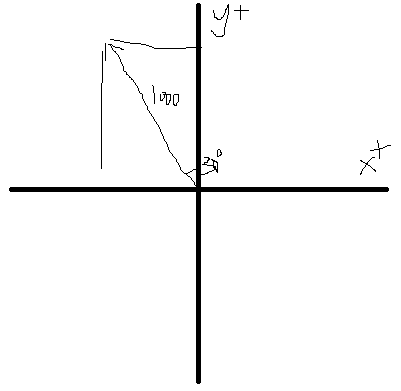
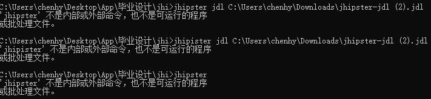

# UAVLocate


# 2025.3 I

## :pushpin:**位置算法**

**（python获取无人机XYZ坐标并算法计算出偏移再传输给springboot,通过service层修改数据库）**

**生成实体（entity）：数据-附带Service类**​​


**x轴坐标posX，y轴坐标posY，z轴坐标posZ。**

**设定出参考点的坐标，固定无人机的飞行速度或通过摄像机确定（复杂），**

**并测量出屏幕坐标移动1个单位现实移动的距离，即可计算XY轴偏离。**

**根据风速风向以及Z轴距离估算降落点最终偏移。**

**举例：参考点设为（10，10，10），假定屏幕1单位对应现实0.02m，风速0.02m/s，风向为北偏西30°。**

**（近地情况无需考虑垂直风向）**

**那么算法实现过程如下：**

**拿到无人机位置坐标（32，56，207），计算出相对坐标（22，46，197），对应现实三维距离（0.44m,0.92m,3.94m)**

**无人机下降速度固定为0.4m/s。**

**那么下降所需时间为197\*0.02/0.4=9.85秒，**

**风速为1000m/h根据风向可拆分为X轴风速和Y轴风速，**

****

**风将使无人机产生的X轴偏移(-1)0.02·sin(30°)\*9.85=-0.0985m**

**风将使无人机产生的Y轴偏移(+1)0.02·cos(30°)\*9.85=0.1706m**

**那么最终偏移即(0.44-0.0985,0.92+0.1706)。**

**首先就这样，也不知道风向能不能通过风速计获取度数。**

### **Python** :link:

**可以直接在Python中实现算法，也可以传入Springboot后。**

```python
import requests
import math

# 无人机当前位置
current_position = (32, 56, 207)  # (X, Y, Z)

# 参考点位置
reference_position = (10, 10, 10)  # (X, Y, Z)

# 风速和风向
wind_speed = 0.02  # m/s
wind_direction = 30  # 北偏西30°，即30°

# 计算相对坐标
relative_position = (
    current_position[0] - reference_position[0],
    current_position[1] - reference_position[1],
    current_position[2] - reference_position[2]
)

# 计算现实中的距离
real_position = (
    relative_position[0] * 0.02,
    relative_position[1] * 0.02,
    relative_position[2] * 0.02
)

# 计算下降时间
descent_speed = 0.4  # m/s
descent_time = real_position[2] / descent_speed

# 计算风向的X轴和Y轴分量
wind_x = wind_speed * math.sin(math.radians(wind_direction))
wind_y = wind_speed * math.cos(math.radians(wind_direction))

# 计算风引起的偏移
wind_offset_x = -wind_x * descent_time
wind_offset_y = wind_y * descent_time

# 计算最终偏移
final_offset = (
    real_position[0] + wind_offset_x,
    real_position[1] + wind_offset_y
)

# 打印结果
print(f"相对坐标: {relative_position}")
print(f"现实距离: {real_position}")
print(f"下降时间: {descent_time} 秒")
print(f"风引起的偏移: X轴 {wind_offset_x} m, Y轴 {wind_offset_y} m")
print(f"最终偏移: {final_offset}")

# 将数据发送到Spring Boot后端
url = "http://localhost:8080/api/drone/position"
data = {
    "x": current_position[0],
    "y": current_position[1],
    "z": current_position[2],
    "final_offset_x": final_offset[0],
    "final_offset_y": final_offset[1]
}
response = requests.post(url, json=data)
print(f"后端响应: {response.text}")
```

### **SpringBoot** :link:

```java
@RestController
@RequestMapping("/api/drone")
public class DronePositionResource {

  @Autowired
  private DronePositionRepository dronePositionRepository;

  @PostMapping("/position")
  public ResponseEntity<String> updateDronePosition(@RequestBody DronePosition position) {
    // 保存数据到数据库
    dronePositionRepository.save(position);
    return ResponseEntity.ok("更新数据成功");
  }
}

```

## **:question: Z坐标获取**

**查阅了一些网页，要获取物体三维坐标的方法有很多，但是双目，三目摄像头获取到的坐标都不够准确。**

**单目+传感器其实是最佳实现方法，不过数据传输速度过慢也是问题，这时我就看到了深度相机，可以使用ai模型**。

**资金充足的情况下想要使用的是Inter的D435i深度相机，那资金不充足怎么办呢**。

# 2025.3 II

## :ballot_box_with_check:项目重启

**做完公司项目之后回来看发现vite报错。**​​

****

**vite是因为nodejs版本被我回退了，用nvm切换到新版本之后把package.json和node_moudles删除后重新安装依赖就没问题了。**

**然后在导入JDL实体的时候jhipster挂了，**

**jhipster为什么会失踪，原来是我重装node的时候把所有的包都清理了。**​​



**成功导入JDL实体。**​​


**启动Springboot，报错端口被占用。**​​


**找到被占用的端口，终止进程。**


**Springboot启动成功​ :v:**​


**在Springboot配置文件application-dev.yml中配置mySql数据库，关闭liquibase伪数据生成。**:paperclip:


**数据界面完成，后面会把数据设为只读。**

**预计实现的内容：（2选1）**

:o: **方案一：每隔几秒更新一条新的数据，并将数据按倒序排列，新数据会显示在最上方。**

​ :speech_balloon: **问题：每隔几秒的时间间隔需要固定可能在某些情况下无法加载出完整数据。**

:o: **方案二：每有数据刷新时更新一条新的数据，并将数据按倒序排列，新数据会显示在最上方。**

​ :speech_balloon: **问题：每有数据刷新就更新可能会时快时慢地刷出数据，不便于测试和查阅。**

**暂且选择第一种方案，先把刷新时间设的久一些，后续再调整。**​​


**在i18n配置中文：**

```json
{
  "uavLocateApp": {
    "statics": {
      "home": {
        "title": "降落点监测数据",
        "refreshListLabel": "刷新",
        "createLabel": "创建新数据",
        "createOrEditLabel": "创建或编辑数据",
        "notFound": "没有找到数据"
      },
      "created": "数据 { param } 创建成功",
      "updated": "数据 { param } 更新成功",
      "deleted": "数据 { param } 删除成功",
      "delete": {
        "question": "你确定要删除数据 { id } 吗？"
      },
      "detail": {
        "title": "降落点监测数据"
      },
      "id": "序号",
      "time": "时间",
      "posX": "X轴偏移",
      "posY": "Y轴偏移",
      "posZ": "Z轴距离",
      "windSpeed": "风速",
      "windDirection": "风向"
    }
  }
}
```

**效果：**


### **SpringBoot** :link:

**用Pageable实现倒序排列数据：**

```java
//Service类
@Transactional(readOnly = true)
public Optional<Statics> findOne(Long id) {
  LOG.debug("Request to get Statics : {}", id);
  return staticsRepository.findById(id);
}

```

**Resource类调用并用getContent()传出List：**

```java
@GetMapping("")
public List<Statics> getAllStatics(@RequestParam(name = "sort", required = false, defaultValue = "id,desc") String sort) {
  LOG.debug("REST request to get all Statics");
  Pageable pageable = PageRequest.of(0, 20);
  if (sort != null && !sort.isEmpty()) {
    String[] sortParams = sort.split(",");
    Sort.Direction direction = "desc".equalsIgnoreCase(sortParams[1]) ? Sort.Direction.DESC : Sort.Direction.ASC;
    pageable = PageRequest.of(pageable.getPageNumber(), pageable.getPageSize(), Sort.by(direction, sortParams[0]));
  }
  return staticsService.findAll(pageable).getContent();
}

```

**效果：**


