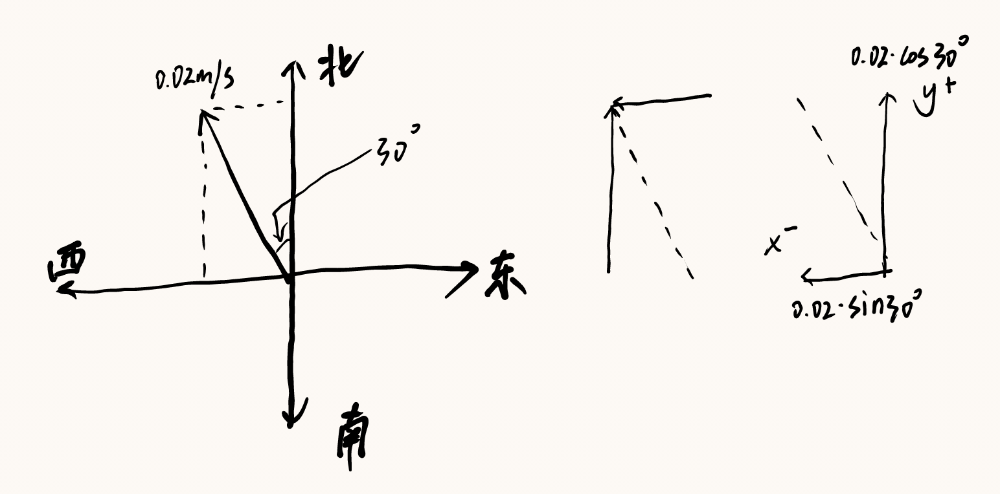
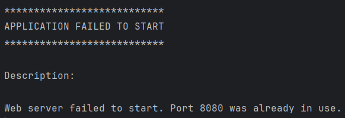
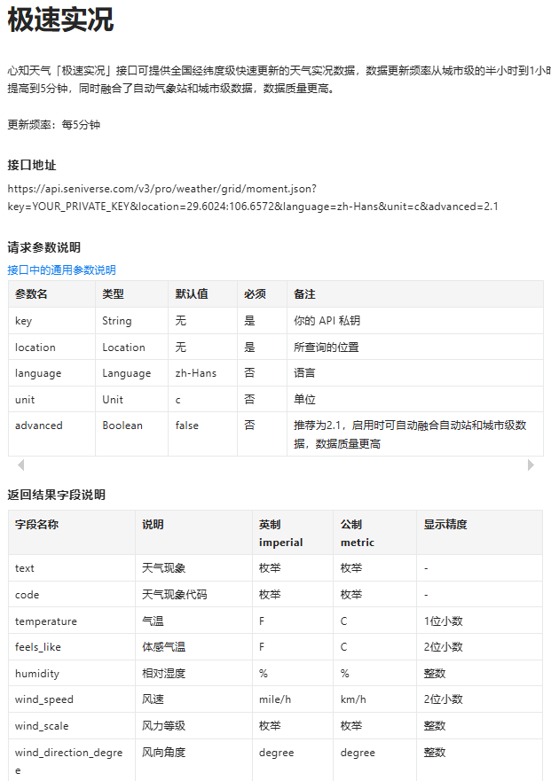

# UAVLocate


# 2025.3 I

## :pushpin: **位置算法**

**（python获取无人机XYZ坐标并算法计算出偏移再传输给springboot,通过service层修改数据库）**

**生成实体（entity）：数据-附带Service类**​​


**x轴坐标posX，y轴坐标posY，z轴坐标posZ。**

**设定出参考点的坐标，固定无人机的飞行速度或通过摄像机确定（复杂），**

**并测量出屏幕坐标移动1个单位现实移动的距离，即可计算XY轴偏离。**

**根据风速风向以及Z轴距离估算降落点最终偏移。**

**举例：参考点设为`（10，10，10）`，假定屏幕1单位对应现实`0.02m`，风速`0.02m/s`，风向为`北偏西30°`。**

**（近地情况无需考虑垂直风向）**

**那么算法实现过程如下：**

**拿到无人机位置坐标`(32，56，207)`，计算出相对坐标`(22，46，197)`，对应现实三维距离`(0.44m,0.92m,3.94m)`**

**无人机下降速度固定为`0.4m/s`。**

**那么下降所需时间为`197\*0.02/0.4=9.85s`，**

**风速为`0.02m/s`根据风向可拆分为X轴风速和Y轴风速，**

****

**风将使无人机产生的X轴偏移`(-1)0.02·sin(30°)\*9.85=-0.0985m`**

**风将使无人机产生的Y轴偏移`(+1)0.02·cos(30°)\*9.85=0.1706m`**

**那么最终偏移即`(0.44-0.0985,0.92+0.1706)`。**

**不过风不可能对无人机造成这么大的偏移，这是理想情况下，现在的飞机还都有防风稳定呢。**

**姿态量变化也没怎么考虑。**

**首先就这样，也不知道风向能不能通过风速计获取度数。**

### **Python** :link:

**可以直接在Python中实现算法，也可以传入Springboot后。**

```python
import requests
import math

# 无人机当前位置
current_position = (32, 56, 207)  # (X, Y, Z)

# 参考点位置
reference_position = (10, 10, 10)  # (X, Y, Z)

# 风速和风向
wind_speed = 0.02  # m/s
wind_direction = 30  # 北偏西30°，即30°

# 计算相对坐标
relative_position = (
    current_position[0] - reference_position[0],
    current_position[1] - reference_position[1],
    current_position[2] - reference_position[2]
)

# 计算现实中的距离
real_position = (
    relative_position[0] * 0.02,
    relative_position[1] * 0.02,
    relative_position[2] * 0.02
)

# 计算下降时间
descent_speed = 0.4  # m/s
descent_time = real_position[2] / descent_speed

# 计算风向的X轴和Y轴分量
wind_x = wind_speed * math.sin(math.radians(wind_direction))
wind_y = wind_speed * math.cos(math.radians(wind_direction))

# 计算风引起的偏移
wind_offset_x = -wind_x * descent_time
wind_offset_y = wind_y * descent_time

# 计算最终偏移
final_offset = (
    real_position[0] + wind_offset_x,
    real_position[1] + wind_offset_y
)

# 打印结果
print(f"相对坐标: {relative_position}")
print(f"现实距离: {real_position}")
print(f"下降时间: {descent_time} 秒")
print(f"风引起的偏移: X轴 {wind_offset_x} m, Y轴 {wind_offset_y} m")
print(f"最终偏移: {final_offset}")

# 将数据发送到Spring Boot后端
url = "http://localhost:8080/api/drone/position"
data = {
    "x": current_position[0],
    "y": current_position[1],
    "z": current_position[2],
    "final_offset_x": final_offset[0],
    "final_offset_y": final_offset[1]
}
response = requests.post(url, json=data)
print(f"后端响应: {response.text}")
```

### **SpringBoot** :link:

```java
@RestController
@RequestMapping("/api/drone")
public class DronePositionResource {

  @Autowired
  private DronePositionRepository dronePositionRepository;

  @PostMapping("/position")
  public ResponseEntity<String> updateDronePosition(@RequestBody DronePosition position) {
    // 保存数据到数据库
    dronePositionRepository.save(position);
    return ResponseEntity.ok("更新数据成功");
  }
}

```

## **:question: Z坐标获取**

**查阅了一些网页，要获取物体三维坐标的方法有很多，但是双目，三目摄像头获取到的坐标都不够准确。**

**单目+传感器其实是最佳实现方法，不过数据传输速度过慢也是问题，这时我就看到了深度相机，可以使用ai模型**。

**资金充足的情况下想要使用的是Inter的D435i深度相机，那资金不充足怎么办呢**。

# 2025.3 II

## :ballot_box_with_check: 项目重启

**做完公司项目之后回来看发现vite报错。**

****

**vite是因为nodejs版本被我回退了，用nvm切换到新版本之后把package.json和node_moudles删除后重新安装依赖就没问题了。**

**然后在导入JDL实体的时候jhipster挂了，**

**jhipster为什么会失踪，原来是我重装node的时候把所有的包都清理了。**


**成功导入JDL实体。**


**启动Springboot，报错端口被占用。**



**找到被占用的端口，终止进程。**


**Springboot启动成功 :v:**


**在Springboot配置文件application-dev.yml中配置mySql数据库，关闭liquibase伪数据生成。**:paperclip:


**数据界面完成，后面会把数据设为只读。**

**预计实现的内容：（2选1）**

:o: **方案一：每隔几秒更新一条新的数据，并将数据按倒序排列，新数据会显示在最上方。**

:speech_balloon: **问题：每隔几秒的时间间隔需要固定可能在某些情况下无法加载出完整数据。**

:o: **方案二：每有数据刷新时更新一条新的数据，并将数据按倒序排列，新数据会显示在最上方。**

:speech_balloon: **问题：每有数据刷新就更新可能会时快时慢地刷出数据，不便于测试和查阅。**

**暂且选择第一种方案，先把刷新时间设的久一些，后续再调整。**


**在i18n配置中文：**

```json
{
  "uavLocateApp": {
    "statics": {
      "home": {
        "title": "降落点监测数据",
        "refreshListLabel": "刷新",
        "createLabel": "创建新数据",
        "createOrEditLabel": "创建或编辑数据",
        "notFound": "没有找到数据"
      },
      "created": "数据 { param } 创建成功",
      "updated": "数据 { param } 更新成功",
      "deleted": "数据 { param } 删除成功",
      "delete": {
        "question": "你确定要删除数据 { id } 吗？"
      },
      "detail": {
        "title": "降落点监测数据"
      },
      "id": "序号",
      "time": "时间",
      "posX": "X轴偏移",
      "posY": "Y轴偏移",
      "posZ": "Z轴距离",
      "windSpeed": "风速",
      "windDirection": "风向"
    }
  }
}
```

**效果：**


### SpringBoot :link:

**用Pageable实现倒序排列数据：**

```java
//Service类
@Transactional(readOnly = true)
public Optional<Statics> findOne(Long id) {
  LOG.debug("Request to get Statics : {}", id);
  return staticsRepository.findById(id);
}

```

**Resource类调用并用getContent()传出排序后的List：**

```java
@GetMapping("")
public List<Statics> getAllStatics(@RequestParam(name = "sort", required = false, defaultValue = "id,desc") String sort) {
  LOG.debug("REST request to get all Statics");
  Pageable pageable = PageRequest.of(0, 20);
  if (sort != null && !sort.isEmpty()) {
    String[] sortParams = sort.split(",");
    Sort.Direction direction = "desc".equalsIgnoreCase(sortParams[1]) ? Sort.Direction.DESC : Sort.Direction.ASC;
    pageable = PageRequest.of(pageable.getPageNumber(), pageable.getPageSize(), Sort.by(direction, sortParams[0]));
  }
  return staticsService.findAll(pageable).getContent();
}

```

**效果：**


# 2025.3 III

## :sun_with_face: 气象API

**由于风速计部署及数据传输过于复杂等原因，改用从API获取数据并传输到Spring Boot中。**

:o:**使用API获取数据的优缺点：**

**API提供了标准化的数据接口，可以直接通过HTTP请求获取数据，无需复杂的硬件设备和现场部署。**

**数据通常以结构化的格式（如JSON或XML）返回，易于解析和处理。**

**并且许多气象API提供实时数据或高频率更新的数据，能够满足对实时气象信息的需求。**

**不过API提供商可能会调整数据格式或接口，需要及时更新代码。而风力计可以实时测量当前的风速和风向，数据获取几乎无延迟。**

**然后是最恐怖的一点：主流气象API每个月都要支付四位数以上的价格。**

**因此也固定算法实现的位置为Springboot的Service类，而不再是使用python，python仅提供无人机的三维位置数据。**


:warning:<font color = red>**若能直接传输到springboot中，python也将停用，但目前仍未选择摄像头。**</font>

**这里选用的是心知天气的API，每五分钟可传输一次数据，足以满足我们的需求。**



**由上图可见接口传输过来的我们所需要的数据为风速`wind_speed`和风向角度`wind_direction_degree`，**

**其中风向角度的数据为整数，那么应该就是0~360的度数，以此对算法度数计算进行更新。**

**具体分析如下：**

**以y轴正半轴为0度，向右增加度数，那么风向度数可以按照以下规则转换为方向：**


**对于介于两个方向之间的度数，可以描述为“偏”某个方向。例如，45°可以描述为“北偏东45度”。**

**计算各个方向的风速:**


**经过测试，心知天气免费版无法获得风速和风向角度数据，不过没有关系，可以试用14天。**

**那么在这之前，先接收一下其它可获取的数据，测试一下API的连通性。**

# 2025.3 IV

## :sunflower: 和风天气API

**今天查阅的时候发现了另一款有360度风向以及每小时风速的免费API：和风天气，每日1000次的访问量已经足够。**


**需要的数据：**

- **`now.wind360` [风向](https://dev.qweather.com/docs/resource/wind-info/#wind-direction)，360角度**
- **`now.windSpeed` [风速](https://dev.qweather.com/docs/resource/wind-info/#wind-speed)，公里/小时**

**API格式：`devapi.qweather.com/v7/weather/now?location=&key=`**

**生成的APIKey：`ec15c8e809f54b009f3ba76ab88c542c`**

**需要使用的城市id：**

**上海市**

- **城市ID: `101020100`**

**德阳市**

- **城市ID: `101272001`**

**:white_check_mark:成功获取到德阳市实时天气数据的 JSON**


### SpringBoot​ :link:

**weatherData:**

```java
package com.chenhy.domain;

import jakarta.persistence.*;
import java.io.Serializable;

@Entity
@Table(name = "weather_data")
public class WeatherData implements Serializable {

  @Id
  @GeneratedValue(strategy = GenerationType.IDENTITY)
  private Long id;

  private String locationId;
  private Integer temperature;
  private Integer windSpeed;
  private String windDirection;
  private String observationTime; // 修改为 String 类型
  // 下面是getter和setter
}

```

**config类中定义restTemplate：**

```java
@Configuration
public class RestTemplateConfig {

  @Bean
  public RestTemplate restTemplate(RestTemplateBuilder builder) {
    // 自定义 SimpleClientHttpRequestFactory 设置超时
    SimpleClientHttpRequestFactory requestFactory = new SimpleClientHttpRequestFactory();
    requestFactory.setConnectTimeout(5000); // 连接超时 5 秒
    requestFactory.setReadTimeout(30000); // 读取超时 30 秒

    // 使用自定义 RequestFactory 构建 RestTemplate
    RestTemplate restTemplate = builder.requestFactory(() -> requestFactory).build();
    return restTemplate;
  }
}

```

**创建service类：**

```java
package com.chenhy.service;

import com.chenhy.domain.WeatherData;
import com.chenhy.repository.WeatherDataRepository;
import com.chenhy.service.dto.HeWeatherNowResponse;
import com.chenhy.service.mapper.WeatherMapper;
import org.slf4j.Logger;
import org.slf4j.LoggerFactory;
import org.springframework.beans.factory.annotation.Value;
import org.springframework.stereotype.Service;
import org.springframework.transaction.annotation.Transactional;
import org.springframework.web.client.RestTemplate;

@Service
@Transactional
public class HeWeatherService {

  private final Logger log = LoggerFactory.getLogger(HeWeatherService.class);

  private final WeatherDataRepository weatherDataRepository;
  private final WeatherMapper weatherMapper;
  private final RestTemplate restTemplate;

  // 配置参数
  @Value("${heweather.api.key}")
  private String apiKey;

  @Value("${heweather.api.url}")
  private String apiUrl;

  public HeWeatherService(WeatherDataRepository weatherDataRepository, WeatherMapper weatherMapper, RestTemplate restTemplate) {
    this.weatherDataRepository = weatherDataRepository;
    this.weatherMapper = weatherMapper;
    this.restTemplate = restTemplate;
  }

  @Transactional
  public HeWeatherNowResponse fetchAndSaveWeather(String locationId) {
    HeWeatherNowResponse response = fetchFromApi(locationId);
    WeatherData weatherData = weatherMapper.toEntity(response);
    weatherData.setLocationId(locationId);
    WeatherData savedData = weatherDataRepository.save(weatherData);
    return weatherMapper.toDto(savedData);
  }

  private HeWeatherNowResponse fetchFromApi(String locationId) {
    String url = String.format("%s?location=%s&key=%s", apiUrl, locationId, apiKey);
    return restTemplate.getForObject(url, HeWeatherNowResponse.class);
  }
}

```

**创建repository类：**

```java
package com.chenhy.repository;

import com.chenhy.domain.WeatherData;
import org.springframework.data.jpa.repository.*;
import org.springframework.stereotype.Repository;

@Repository
public interface WeatherDataRepository extends JpaRepository<WeatherData, Long> {
  // 添加自定义查询方法
  WeatherData findFirstByLocationIdOrderByObservationTimeDesc(String locationId);
}

```

**根据返回的 JSON格式创建DTO：**

```java
package com.chenhy.service.dto;

import java.util.List;

public class HeWeatherNowResponse {

  private String code;
  private String updateTime;
  private String fxLink;
  private Now now;
  private Refer refer;

  // Getters和Setters

  public static class Now {

    private String obsTime;
    private Integer temp;
    private String feelsLike;
    private String icon;
    private String text;
    private String wind360;
    private String windDir;
    private String windScale;
    private Integer windSpeed;
    private String humidity;
    private String precip;
    private String pressure;
    private String vis;
    private String cloud;
    private String dew;
    // Getters和Setters
  }

  public static class Refer {

    private List<String> sources;
    private List<String> license;
    // Getters和Setters
  }
}

```

**路由控制器：**

```java
package com.chenhy.web.rest;

import com.chenhy.domain.WeatherData;
import com.chenhy.service.HeWeatherService;
import com.chenhy.service.dto.HeWeatherNowResponse;
import org.slf4j.Logger;
import org.slf4j.LoggerFactory;
import org.springframework.http.ResponseEntity;
import org.springframework.web.bind.annotation.*;

@RestController
@RequestMapping("/api/weather")
public class WeatherResource {

  private final Logger log = LoggerFactory.getLogger(WeatherResource.class);

  private final HeWeatherService heWeatherService;

  public WeatherResource(HeWeatherService heWeatherService) {
    this.heWeatherService = heWeatherService;
  }

  @GetMapping("/{locationId}")
  public ResponseEntity<HeWeatherNowResponse> getWeatherData(@PathVariable String locationId) {
    log.debug("REST request to get weather for location: {}", locationId);
    HeWeatherNowResponse result = heWeatherService.fetchAndSaveWeather(locationId);
    return ResponseEntity.ok(result);
  }
}

```

# 2025.3 V

## :package: ​JSON解包

**测试昨天写的API接口，一直报错返回的 JSON含有非法字符，对非法字符处理后仍然无法正常接收到 JSON。**

**今天回去和风天气的开放文档又看了看，发现其API返回的数据均使用了Gzip压缩，那么接下来对Gzip进行处理。**

### SpringBoot :link:

```java
@Configuration
public class RestTemplateConfig {

  @Bean
  public RestTemplate restTemplate(RestTemplateBuilder builder) {
    // 自定义 SimpleClientHttpRequestFactory 设置超时
    SimpleClientHttpRequestFactory requestFactory = new SimpleClientHttpRequestFactory();
    requestFactory.setConnectTimeout(5000); // 连接超时 5 秒
    requestFactory.setReadTimeout(30000); // 读取超时 30 秒

    // 使用自定义 RequestFactory 构建 RestTemplate
    RestTemplate restTemplate = builder.requestFactory(() -> requestFactory).build();

    // 添加 Gzip 解压缩拦截器
    List<ClientHttpRequestInterceptor> interceptors = new ArrayList<>(restTemplate.getInterceptors());
    interceptors.add(new GzipDecompressingClientHttpRequestInterceptor());
    restTemplate.setInterceptors(interceptors);

    return restTemplate;
  }

  // 自定义 Gzip 解压缩拦截器
  public static class GzipDecompressingClientHttpRequestInterceptor implements ClientHttpRequestInterceptor {

    @Override
    public ClientHttpResponse intercept(HttpRequest request, byte[] body, ClientHttpRequestExecution execution) throws IOException {
      ClientHttpResponse response = execution.execute(request, body);
      if (isGzipResponse(response)) {
        return new GzipDecompressingClientHttpResponse(response);
      }
      return response;
    }

    private boolean isGzipResponse(ClientHttpResponse response) {
      return "gzip".equalsIgnoreCase(response.getHeaders().getFirst("Content-Encoding"));
    }

    private static class GzipDecompressingClientHttpResponse implements ClientHttpResponse {

      private final ClientHttpResponse response;

      public GzipDecompressingClientHttpResponse(ClientHttpResponse response) {
        this.response = response;
      }

      @Override
      public InputStream getBody() throws IOException {
        return new GZIPInputStream(response.getBody());
      }

      @Override
      public HttpStatusCode getStatusCode() throws IOException {
        return response.getStatusCode();
      }

      @Override
      public String getStatusText() throws IOException {
        return response.getStatusText();
      }

      @Override
      public void close() {
        response.close();
      }

      @Override
      public org.springframework.http.HttpHeaders getHeaders() {
        return response.getHeaders();
      }
    }
  }
}

```

**在mySql中创建用来接受天气数据的表：**

****

**成功获得气象数据并存入数据库表：**

****

**调用测试：**

****

**测试页面:/weather：**


**至此已完成气象API的调用，获得的数据是wind360和windSpeed，并存在表weather_data中。**

# 2025.3 VI

## :hourglass: ​定时更新

**添加功能（逻辑）：每十秒更新一条Statics，并调用weatherDataRepository的**

**findFirstByLocationIdOrderByObservationTimeDesc(locationId)方法，**

**将数据表weather_data最新一条数据的风速和风向存入该条新数据中。**

### SpringBoot :link:

**WeatherDataRepository内自定义查询方法:**

```java
WeatherData findFirstByLocationIdOrderByObservationTimeDesc(String locationId);

```

**SpringBoot程序添加注解启用定时任务：**

```java
import org.springframework.scheduling.annotation.EnableScheduling;

@SpringBootApplication
@EnableScheduling
```

**StaticsService内逻辑实现：**

```java
@Scheduled(fixedRate = 10000) // 10s
public void addNewStatics() {
  LOG.debug("Executing scheduled task to add new Statics");

  String locationId = "101272001"; // 用德阳测试
  LOG.debug("Using locationId: {}", locationId); // 添加日志输出locationId

  // 获取最新的WeatherData记录
  WeatherData latestWeatherData = weatherDataRepository.findFirstByLocationIdOrderByObservationTimeDesc(locationId);
  if (latestWeatherData != null) {
    Statics newStatics = new Statics();
    newStatics.setWindSpeed(latestWeatherData.getWindSpeed().longValue());
    newStatics.setWindDirection(latestWeatherData.getWindDirection());

    // 设置其他字段，这里假设其他字段可以为null或默认值
    newStatics.setTime(java.time.Instant.now());
    newStatics.setPosX(0L);
    newStatics.setPosY(0L);
    newStatics.setPosZ(0L);

    // 保存新的Statics记录
    Statics savedStatics = save(newStatics);
    LOG.debug("New Statics record added with ID: {}", savedStatics.getId());
  } else {
    LOG.warn("No latest WeatherData found to create a new Statics record for locationId: {}", locationId); // 修改日志输出，包含locationId
  }
}

```

**效果：**


**接下来需要的是获取XYZ坐标并存入另一个表PosData中，再调用赋予给这条新数据的XYZ字段上。**

**虽然说是风向360，但是最少也有45°的差距......**

**今天再更新一下前端，下个月要做算法了。**

**现在的数据界面数据是静态的，需要刷新才会显示出新数据，我试着把它做成响应式的吧。**

**在做开题报告的时候就把最初版本的前端给做出来了，没有记录。那接下来就把首页翻新一下。**

# 2025.4 I

## :bookmark_tabs: 前端更新

**之前那个首页确实有点丑了，新的设计方案大概就是在首页放置几个模块，模块内存放icon和数据。**

**前一段时间给公司做的大屏前端就刚好能拿来用了。**

**先将statics界面设为动态响应式，每秒自动刷新一次数据。**

### TypeScript​ :link:

**statics.component.ts:**

```typescript
import { type Ref, defineComponent, inject, onMounted, onUnmounted, ref } from 'vue';
import { useI18n } from 'vue-i18n';
import axios from 'axios';

import StaticsService from './statics.service';
import { type IStatics } from '@/shared/model/statics.model';
import { useDateFormat } from '@/shared/composables';
import { useAlertService } from '@/shared/alert/alert.service';

export default defineComponent({
  compatConfig: { MODE: 3 },
  name: 'Statics',
  setup() {
    const { t: t$ } = useI18n();
    const dateFormat = useDateFormat();
    const staticsService = inject('staticsService', () => new StaticsService());
    const alertService = inject('alertService', () => useAlertService(), true);

    const statics: Ref<IStatics[]> = ref([]);
    const isFetching = ref(false);
    let refreshInterval: number | null = null;

    const clear = () => {
      if (refreshInterval) {
        window.clearInterval(refreshInterval);
        refreshInterval = null;
      }
    };

    const retrieveStaticss = async () => {
      if (isFetching.value) return; // 防止重复请求
      isFetching.value = true;
      try {
        const res = await staticsService().retrieve();
        statics.value = res.data;
      } catch (err: unknown) {
        if (axios.isAxiosError(err)) {
          alertService.showHttpError(err.response);
        }
      } finally {
        isFetching.value = false;
      }
    };

    const handleSyncList = () => {
      retrieveStaticss();
    };

    onMounted(async () => {
      await retrieveStaticss();
      // 每1秒自动刷新一次数据
      refreshInterval = window.setInterval(retrieveStaticss, 1000);
    });

    onUnmounted(() => {
      clear();
    });

    const removeId = ref<number | null>(null);
    const removeEntity = ref<any>(null);
    const prepareRemove = (instance: IStatics) => {
      if (instance.id) {
        removeId.value = instance.id;
        removeEntity.value.show();
      }
    };
    const closeDialog = () => {
      removeEntity.value.hide();
    };
    const removeStatics = async () => {
      if (!removeId.value) return;
      try {
        await staticsService().delete(removeId.value);
        const message = t$('uavLocateApp.statics.deleted', { param: removeId.value }).toString();
        alertService.showInfo(message, { variant: 'danger' });
        removeId.value = null;
        retrieveStaticss();
        closeDialog();
      } catch (error: unknown) {
        if (axios.isAxiosError(error)) {
          alertService.showHttpError(error.response);
        }
      }
    };

    return {
      statics,
      handleSyncList,
      isFetching,
      retrieveStaticss,
      clear,
      ...dateFormat,
      removeId,
      removeEntity,
      prepareRemove,
      closeDialog,
      removeStatics,
      t$,
    };
  },
});
```

**效果：**


**接下来美化一下首页：头图+标题，左右两侧的半透明Sidebar。**

**导入滚动栏，用于展示当前无人机的位置数据以及当前风速风向。**

### Vue :link:

**组件scrollBox.vue:**

```vue
<template>
  <div class="dqsj">
    <div class="dqsjtext">当前数据</div>
    <div class="lbg-container">
      <div class="lbgmc"></div>
      <div class="lbgmctext">
        序号&nbsp;&nbsp;&nbsp;&nbsp;时间&nbsp;&nbsp;&nbsp;&nbsp;&nbsp;&nbsp;&nbsp;&nbsp;&nbsp;&nbsp;&nbsp;&nbsp;&nbsp;&nbsp;&nbsp;&nbsp;&nbsp;&nbsp;&nbsp;&nbsp;&nbsp;&nbsp;&nbsp;&nbsp;&nbsp;&nbsp;&nbsp;&nbsp;&nbsp;&nbsp;&nbsp;&nbsp;&nbsp;&nbsp;&nbsp;&nbsp;&nbsp;&nbsp;&nbsp;&nbsp;X轴&nbsp;&nbsp;&nbsp;&nbsp;&nbsp;&nbsp;&nbsp;&nbsp;&nbsp;&nbsp;Y轴&nbsp;&nbsp;&nbsp;&nbsp;&nbsp;&nbsp;&nbsp;&nbsp;&nbsp;&nbsp;Z轴&nbsp;&nbsp;&nbsp;&nbsp;&nbsp;&nbsp;&nbsp;&nbsp;&nbsp;&nbsp;&nbsp;&nbsp;风速&nbsp;&nbsp;&nbsp;&nbsp;&nbsp;&nbsp;&nbsp;&nbsp;&nbsp;&nbsp;&nbsp;&nbsp;&nbsp;&nbsp;&nbsp;&nbsp;风向
      </div>
    </div>
    <vue3ScrollSeamless class="scroll-wrap" :classOptions="classOptions" :dataList="formattedList">
      <div v-if="formattedList.length > 0">
        <el-row v-for="(item, i) of formattedList" :key="i">
          <el-col :span="10" class="lbg">
            <div>{{ item }}</div>
          </el-col>
        </el-row>
      </div>
    </vue3ScrollSeamless>
  </div>
</template>

<script setup>
import { reactive, ref, computed, onMounted } from 'vue';
import { vue3ScrollSeamless } from 'vue3-scroll-seamless';
import StaticsService from '@/entities/statics/statics.service';
import { useDateFormat } from '@/shared/composables';

const dateFormat = useDateFormat();
const staticsService = new StaticsService();
const statics = ref([]);

const formattedList = computed(() => {
  return statics.value.map((item, index) => {
    const time = dateFormat.formatDateShort(item.time);
    return `\xa0\xa0\xa0\xa0\xa0\xa0\xa0\xa0\xa0\xa0\xa0\xa0\xa0\xa0\xa0\xa0\xa0\xa0${index + 1}\xa0\xa0\xa0\xa0\xa0\xa0\xa0\xa0${time}\xa0\xa0\xa0\xa0\xa0\xa0\xa0\xa0\xa0\xa0\xa0\xa0\xa0\xa0\xa0\xa0${item.posX}\xa0\xa0\xa0\xa0\xa0\xa0\xa0\xa0\xa0\xa0\xa0\xa0\xa0\xa0\xa0\xa0${item.posY}\xa0\xa0\xa0\xa0\xa0\xa0\xa0\xa0\xa0\xa0\xa0\xa0\xa0\xa0\xa0\xa0${item.posZ}\xa0\xa0\xa0\xa0\xa0\xa0\xa0\xa0\xa0\xa0\xa0\xa0\xa0\xa0\xa0\xa0\xa0\xa0\xa0\xa0\xa0\xa0\xa0\xa0${item.windSpeed}\xa0\xa0\xa0\xa0\xa0\xa0\xa0\xa0\xa0\xa0\xa0\xa0\xa0\xa0\xa0\xa0\xa0\xa0\xa0\xa0\xa0\xa0\xa0\xa0${item.windDirection}\xa0\xa0\xa0\xa0\xa0\xa0`;
  });
});

const classOptions = reactive({
  step: 0.5,
  limitMoveNum: 10,
  direction: 1,
});

const retrieveStaticss = async () => {
  try {
    const res = await staticsService.retrieve();
    statics.value = res.data;
  } catch (err) {
    console.error('Error fetching statics:', err);
  }
};

onMounted(async () => {
  await retrieveStaticss();
  // 每1秒刷新一次数据
  setInterval(retrieveStaticss, 1000);
});
</script>
```

**这里不可能调用API，而是调用了数据库最新一条的数据，这样可以节省API申请次数。**

**效果：展示20个数据，新的数据序号在前，保持刷新。**


# 2025.4 II

## :bookmark: 前端更新

**这几天公司的任务稍微有点多，不过都做好了，现在让我们继续来更新前端。**

**我又想了想这样的前端确实是有些商业化了，以至于不会让人觉得是一个学生做的，所以我们还是做得简约一点吧。**

**直接从学校官网扒了几张图片拿来用，先把科技感满满的头图给换掉，右边的滚动栏暂时保留。**

**左侧放的是最终偏移数据，占用不了很大的空间，总之先缩短。**


**这样的话空间也足以接入摄像头的画面。**

**先插入一个视频播放器替代。**

**一共添加两个组件：**

- **将天气数据获取到的风速和风向展示出来**
- **以及实时监控视频**

**效果：（先填充了一个网上扒的测试视频）**


**那么中间空余的部分就非最终偏移数据莫属了，接下来完善后端算法。**

# 2025.4 III

## :chart_with_upwards_trend: 算法重写

**目前不再打算使用价格高昂的Intel D400家族深度相机，而是使用四目普通摄像头识别。**


**演示时仅在网页展示四个视频，并获取视频中无人机的三维坐标，若有后续需求再考虑加装深度相机。**

**先在前端添加一个录入框，输入测试用的无人机三维坐标XYZ（单位：米）**

**发送到后端存入statics实体交给算法处理。**


**成功写入坐标：**


**考虑到偏移坐标不需要存储到数据库，我们直接在TypeScript中完成简单算法，这样可以直接调用所有计算所需的参数。**

**由于目前单位仍未确定，先假定写入的测试数据单位为坐标格，转化关系为1坐标格1毫米。**

**以当前参数（1000，-1000，1000，14，225）为例：**

**步骤：**

**1.风向筛子**

**将风向模拟为一个坐标轴，因为各个象限计算方式不同，所以先初步将风向筛为四种。**

**仍然是参考这张图：**


**不同风向x轴y轴风向正负及计算方式不同，我先在代码中简单易懂地完成这部分。**

### TypeScript :link:

**countData为计算最终偏移的函数，参数为XYZ坐标及风速风向。**

**Z轴坐标为计算降落时间的参数，Z轴距离除以降落速度即为降落时间。**

**这里先把降落速度设为定值（1000毫米每秒）**

```typescript
const countData = (posX: number, posY: number, posZ: number, windSpeed: number, windDirection: number | string): FinalData => {
  // 转换风向360为数字
  const windDir = typeof windDirection === 'string' ? parseFloat(windDirection) : windDirection;

  // 根据风向角度计算x和y方向分量
  let windX = 0;
  let windY = 0;

  // 降落速度先设为定值：1000毫米每秒
  let landSpeed = 1000;

  // 将角度转换为弧度进行计算
  const degToRad = (degrees: number) => (degrees * Math.PI) / 180;
  const theta = degToRad(windDir);

  // 根据风向范围计算分量
  if (windDir >= 0 && windDir < 90) {
    // 第一象限: 0-90度
    // x方向风速 = v * sin(θ)
    // y方向风速 = v * cos(θ)
    windX = windSpeed * Math.sin(theta);
    windY = windSpeed * Math.cos(theta);
    console.log(`风向:${windDir}°(0-90°), X向风速:${windX.toFixed(2)}, Y向风速:${windY.toFixed(2)}`);
  } else if (windDir >= 90 && windDir < 180) {
    // 第二象限: 90-180度
    // x方向风速 = v * cos(θ-90°)
    // y方向风速 = -v * sin(θ-90°)
    const adjustedTheta = degToRad(windDir - 90);
    windX = windSpeed * Math.cos(adjustedTheta);
    windY = -windSpeed * Math.sin(adjustedTheta);
    console.log(`风向:${windDir}°(90-180°), X向风速:${windX.toFixed(2)}, Y向风速:${windY.toFixed(2)}`);
  } else if (windDir >= 180 && windDir < 270) {
    // 第三象限: 180-270度
    // x方向风速 = -v * sin(θ-180°)
    // y方向风速 = -v * cos(θ-180°)
    const adjustedTheta = degToRad(windDir - 180);
    windX = -windSpeed * Math.sin(adjustedTheta);
    windY = -windSpeed * Math.cos(adjustedTheta);
    console.log(`风向:${windDir}°(180-270°), X向风速:${windX.toFixed(2)}, Y向风速:${windY.toFixed(2)}`);
  } else if (windDir >= 270 && windDir <= 360) {
    // 第四象限: 270-360度
    // x方向风速 = -v * cos(θ-270°)
    // y方向风速 = v * sin(θ-270°)
    const adjustedTheta = degToRad(windDir - 270);
    windX = -windSpeed * Math.cos(adjustedTheta);
    windY = windSpeed * Math.sin(adjustedTheta);
    console.log(`风向:${windDir}°(270-360°), X向风速:${windX.toFixed(2)}, Y向风速:${windY.toFixed(2)}`);
  }

  // 计算最终偏移值
  // 为了解决未赋值前使用变量的问题，先声明再赋值
  let calculatedXOffset = 0;
  let calculatedYOffset = 0;
  let calculatedZOffset = 0;

  calculatedXOffset = windX * (posZ / landSpeed);
  calculatedYOffset = windY * (posZ / landSpeed);
  calculatedZOffset = posZ; // Z轴偏移暂不考虑风向影响

  return {
    xOffset: calculatedXOffset,
    yOffset: calculatedYOffset,
    zOffset: calculatedZOffset,
  };
};
```

**注：该组件查找的是最新的一条Z轴（posZ）不为0的数据进行计算。**

**并且计算结果仅为风使其偏移的距离，后续需要加上降落点位置的坐标，**

**在风向偏移距离的基础上加上当前位置离降落点的距离。**

**写法如下：**

```typescript
// 添加目标降落点XY坐标
let targetPosX;
let targetPosY;
let targetPosZ;
...
// 合并
calculatedXOffset = Math.abs(targetPosX - posX) + windX * (posZ/landSpeed);
calculatedYOffset = Math.abs(targetPosY - posY) + windY * (posZ/landSpeed);
calculatedZoffset = Math.abs(posZ - targetPosZ);
```

**在这里我先令目标降落点坐标为(0,0,0)**

**效果：**


# 2025.4 IV

## :electric_plug:三维坐标获取

**今天网上冲浪的时候看到闲鱼上奥比中光的Astra Pro深度摄像头只卖85一个，赶紧入手了一个。**

**等过几天到货了试试基本功能没问题的话就可以拿来测三维坐标了。**

# :computer: ​编译说明

**node版本：^22**

**jdk：21/23**

**前端运行：npm start**

**端口：9000**

# :open_file_folder: ​项目结构

**后端 (src/main/java/com/chenhy/ - ):**

- **config/: Spring 的配置类。**

- **domain/: JPA 实体类，代表数据库中的表（WeatherData.java）。**

- **repository/: Spring Data JPA 仓库接口，用于数据库访问（WeatherDataRepository.java）。**

- **service/: 业务逻辑层，包含服务类（HeWeatherService.java）、数据转换的 Mapper（WeatherMapper.java）和数据传输对象 DTO（HeWeatherNowResponse.java）。**

- **web/rest/: Spring MVC/WebFlux 的 REST 控制器，处理 API 请求（WeatherResource.java）。**

- **security/: Spring Security 相关的安全配置。**

- **其他包: aop (切面)、management (管理端点) 等。**

**前端 (src/main/webapp/app/):**

- **core/: 核心应用组件，主页 (home.vue)、导航栏、登录页面等。**

- **entities/: 与 JHipster 生成的实体相关的组件（例如 statics/statics.vue, statics.component.ts）。**

- **shared/: 可重用的组件、前端数据模型 (statics.model.ts)、服务、工具函数、前端的国际化 (i18n) 文件等。**

- **account/: 用户账户管理相关的组件。**

- **admin/: 管理功能相关的组件（用户管理、系统指标、日志等）。**

- **router/: Vue Router 的路由配置。**

- **assets/ 或 static/: 静态资源，如图片、字体等。**

- **styles/: 全局 CSS 样式。**

- **main.ts: Vue 应用的主入口文件。**

- **App.vue: Vue 应用的根组件。**

- **decoration/: 添加的装饰性或特定功能的 UI 组件（headerImage.vue, getwinds.vue, finalData.vue 等）。**

**配置 (src/main/resources/)**

- **config/application.yml (及 .properties): 主要的 Spring Boot 配置文件（数据库连接、服务器端口、第三方 API 密钥等）。**

- **i18n/: 后端消息的国际化文件。**

- **liquibase/: 数据库表结构变更（迁移）的记录文件。**

- **static/ 或 public/: 由 Web 服务器直接提供服务的静态资源。**

- **templates/: 服务端模板文件（用于生成邮件内容）。**
