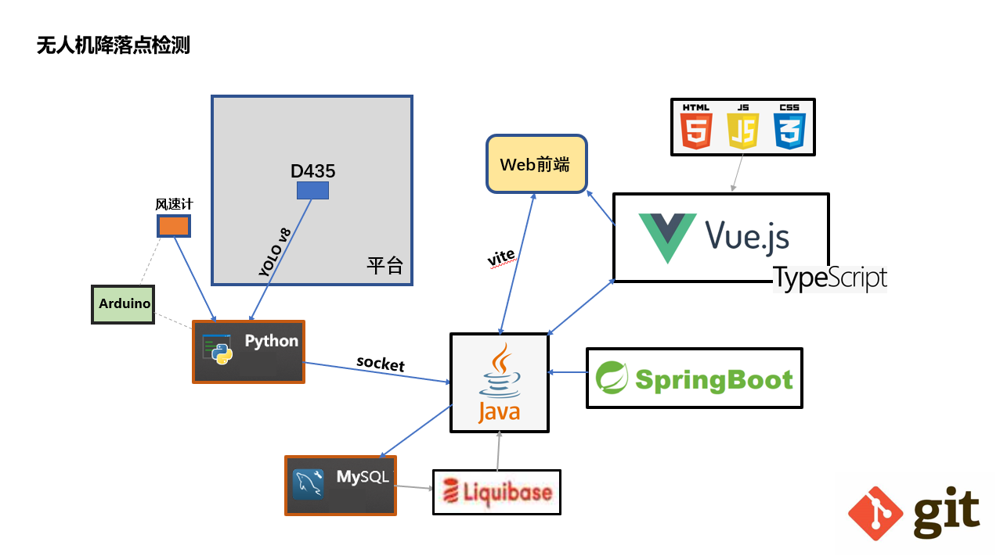

# UAVLocate



# 2025.3

## :pushpin:**位置算法**

**（python获取无人机XYZ坐标并算法计算出偏移再传输给springboot,通过service层修改数据库）**

**生成实体（entity）：数据-附带Service类**


**x轴坐标posX，y轴坐标posY，z轴坐标posZ。**

**设定出参考点的坐标，固定无人机的飞行速度或通过摄像机确定（复杂），**

**并测量出屏幕坐标移动1个单位现实移动的距离，即可计算XY轴偏离。**

**根据风速风向以及Z轴距离估算降落点最终偏移。**

**举例：参考点设为（10，10，10），假定屏幕1单位对应现实0.02m，风速0.02m/s，风向为北偏西30°。**

**（近地情况无需考虑垂直风向）**

**那么算法实现过程如下：**

**拿到无人机位置坐标（32，56，207），计算出相对坐标（22，46，197），对应现实三维距离（0.44m,0.92m,3.94m)**

**无人机下降速度固定为0.4m/s。**

**那么下降所需时间为197\*0.02/0.4=9.85秒，**

**风速为1000m/h根据风向可拆分为X轴风速和Y轴风速，**

****

**风将使无人机产生的X轴偏移(-1)0.02·sin(30°)\*9.85=-0.0985m**

**风将使无人机产生的Y轴偏移(+1)0.02·cos(30°)\*9.85=0.1706m**

**那么最终偏移即(0.44-0.0985,0.92+0.1706)。**

**首先就这样，也不知道风向能不能通过风速计获取度数。**

### **Python**

```python
import requests
import math

# 无人机当前位置
current_position = (32, 56, 207)  # (X, Y, Z)

# 参考点位置
reference_position = (10, 10, 10)  # (X, Y, Z)

# 风速和风向
wind_speed = 0.02  # m/s
wind_direction = 30  # 北偏西30°，即30°

# 计算相对坐标
relative_position = (
    current_position[0] - reference_position[0],
    current_position[1] - reference_position[1],
    current_position[2] - reference_position[2]
)

# 计算现实中的距离
real_position = (
    relative_position[0] * 0.02,
    relative_position[1] * 0.02,
    relative_position[2] * 0.02
)

# 计算下降时间
descent_speed = 0.4  # m/s
descent_time = real_position[2] / descent_speed

# 计算风向的X轴和Y轴分量
wind_x = wind_speed * math.sin(math.radians(wind_direction))
wind_y = wind_speed * math.cos(math.radians(wind_direction))

# 计算风引起的偏移
wind_offset_x = -wind_x * descent_time
wind_offset_y = wind_y * descent_time

# 计算最终偏移
final_offset = (
    real_position[0] + wind_offset_x,
    real_position[1] + wind_offset_y
)

# 打印结果
print(f"相对坐标: {relative_position}")
print(f"现实距离: {real_position}")
print(f"下降时间: {descent_time} 秒")
print(f"风引起的偏移: X轴 {wind_offset_x} m, Y轴 {wind_offset_y} m")
print(f"最终偏移: {final_offset}")

# 将数据发送到Spring Boot后端
url = "http://localhost:8080/api/drone/position"
data = {
    "x": current_position[0],
    "y": current_position[1],
    "z": current_position[2],
    "final_offset_x": final_offset[0],
    "final_offset_y": final_offset[1]
}
response = requests.post(url, json=data)
print(f"后端响应: {response.text}")
```

### **SpringBoot**

```java
@RestController
@RequestMapping("/api/drone")
public class DronePositionResource {

  @Autowired
  private DronePositionRepository dronePositionRepository;

  @PostMapping("/position")
  public ResponseEntity<String> updateDronePosition(@RequestBody DronePosition position) {
    // 保存无人机位置到数据库
    dronePositionRepository.save(position);
    return ResponseEntity.ok("位置更新成功");
  }
}

```

## **:question: Z坐标获取**

**资金充足的情况下想要使用的是Inter的深度相机，那资金不充足怎么办呢**
